# 操作系统第一次作业

##                                           					***YunOS*进程和资源管理系统**

```bash
                ==========================================================================
                                              Welcome to YunOS
                ==========================================================================
                      ___           ___           ___           ___           ___
                     |\__\         /\__\         /\__\         /\  \         /\  \
                     |:|  |       /:/  /        /::|  |       /::\  \       /::\  \
                     |:|  |      /:/  /        /:|:|  |      /:/\:\  \     /:/\ \  \
                     |:|__|__   /:/  /  ___   /:/|:|  |__   /:/  \:\  \   _\:\~\ \  \
                     /::::\__\ /:/__/  /\__\ /:/ |:| /\__\ /:/__/ \:\__\ /\ \:\ \ \__\
                    /:/~~/~    \:\  \ /:/  / \/__|:|/:/  / \:\  \ /:/  / \:\ \:\ \/__/
                   /:/  /       \:\  /:/  /      |:/:/  /   \:\  /:/  /   \:\ \:\__\
                   \/__/         \:\/:/  /       |::/  /     \:\/:/  /     \:\/:/  /
                                  \::/  /        /:/  /       \::/  /       \::/  /
                                   \/__/         \/__/         \/__/         \/__/
                ==========================================================================
```

## 1.实验内容

### 1.1 实验目的

​	本实验旨在模拟实现一个具有进程和资源管理功能的操作系统环境，通过设计和实现自定义的shell终端，深入理解操作系统的核心机制，尤其是进程状态管理、资源分配与回收、死锁避免与检测等关键内容。通过编写系统代码，掌握操作系统中的进程创建、销毁、调度等操作。同时，学习通过银行家算法等经典方法避免死锁，并通过实际操作测试系统的稳定性与功能。

- 深入理解操作系统中进程管理和资源管理的基本概念
- 掌握进程状态转换、进程调度、资源分配、时间片轮转调度等核心机制
- 理解并实现死锁的检测与避免算法
- 培养系统编程和问题解决能力

### 1.2 实验要求

实验任务要求开发一个自定义shell终端，模拟实现以下功能（**粗体**为实验手册中非必要的功能）：

1. **进程管理**：支持创建、销毁、激活进程。通过就绪队列的管理，实现多级优先级的时间轮转调度。具体而言，要实现的基本功能为：
   - 进程管理：Create()、Destroy()、Activate()
2. **资源管理**：实现资源的请求与释放，支持进程对系统资源的动态请求与分配。具体而言，要实现的功能包括
   - 资源管理：Request()、Release()
3. **扩展功能**：
   - 进程的IO请求管理，使进程能够请求IO资源并进入阻塞态，直到IO完成。具体而言，要实现的功能包括：
     - **Request_IO()、IO_completion()**
   - 通过模拟时间片管理，实现进程时间片耗尽后进入调度队列。具体而言，要实现的功能包括：
     - **Timeout()**
4. **系统资源**：包含多种固定资源供进程请求和释放，同时支持IO资源的管理。
5. **死锁检测与避免：通过死锁检测算法，演示进程可能发生的死锁，并通过强制进程销毁等方式解除死锁。**
6. **交互性要求**：通过自定义shell实现命令行交互，用户能够通过命令实现对系统的操作，**并通过特定的方法查看系统状态**。

### 1.3 实验环境

- 开发语言：C语言
- 开发环境：
  - 操作系统：Windows 11 家庭中文版
  - 编译器：TDM-GCC 9.2.0 64-bit Release
  - 开发IDE：Visual Studio Enterprise 2022

### 1.4 实验设计

- 系统开发

  - 数据结构设计：选取并实现适合表示系统、进程、资源以及相关内容的结构体，便于后续开发，包括：
    - **进程控制块（PCB）**：该结构体用于表示每一个进程的状态信息。PCB中需要保存进程ID、优先级（priority）、当前状态（state）、已分配和最大资源需求（resources 和 max_resources）等。
    - **资源控制块（Resource）**：该结构体用于管理系统中的各种资源，需要保存资源总量（total_units）、可用资源量（available_units）以及等待该资源的进程列表（waiting_list）。
    - **系统结构体（System）**：该结构体包含系统中的所有进程列表、就绪队列、多种资源列表以及当前运行的进程等。

  - 核心功能实现：实现上文中提出的功能，完成系统进程创建、销毁、调度，资源分配、收回等逻辑，具体而言，包括：

    - **进程管理**：

      - **创建进程**：创建进程，生成对应的PCB，并将其加入到系统的就绪队列中。新进程根据其优先级被安排到合适的优先级队列中，等待调度。
      - **销毁进程**：销毁指定进程，包括回收该进程占用的资源，并对其子进程做相应处理（转交守护进程或递归销毁）。
      - **激活进程**：强制激活某一进程为当前运行进程，更新进程状态。
      - **调度机制**：实现调度功能，确保按照优先级选择合适的进程进行运行。

      **资源管理**：

      - **资源请求**：实现进程对资源的请求操作。系统检查资源的可用性，并根据请求将资源分配给进程。如果资源不足，进程进入阻塞状态，加入资源的等待队列。
      - **资源释放**：实现进程对资源的释放，并将释放的资源重新分配给等待该资源的其他进程。

      **IO管理**：

      - **IO请求**：模拟进程的IO请求。进程在请求IO资源时被阻塞，等待IO完成。
      - **IO完成**：模拟IO操作的完成，将等待IO的进程从阻塞状态移回就绪队列，等待再次被调度执行。

      **死锁避免与检测**：

      - 实现经典的**银行家算法**，用于检查进程在资源分配后的系统状态是否安全。若资源分配导致系统进入不安全状态，进程的请求将被拒绝。
      - 在未开启死锁避免机制时，实现死锁检测算法，系统能够检测进程之间的循环依赖，并提示用户采取措施解除死锁

  - 命令系统实现：命令系统通过自定义shell与用户交互，主要实现以下功能：
    - **命令解析**：命令行可以解析用户输入的命令，将命令和参数分离，并调用相应的系统功能。
    - **命令执行**：解析后的命令调用具体的进程和资源管理函数。
    - **状态显示**：系统能够根据操作者需求展示当前所有进程的状态、资源的使用情况以及等待队列的内容，帮助用户了解系统运行情况。

- 系统测试
  - 功能测试：在功能测试中，我们将设计多个测试用例，以验证系统的核心功能是否正常运行。这些测试将涉及：
    - **进程创建与调度**：创建多个不同优先级的进程，并验证进程是否按照优先级正确加入就绪队列，且调度器是否能够正确调度高优先级进程优先运行。
    - **进程销毁与资源回收**：测试进程的销毁功能，确保进程占用的资源在销毁后能够正确回收，并被重新分配给等待的进程。
    - **资源请求与释放**：模拟进程请求系统资源并释放资源的操作，检查系统对资源分配的处理，特别是在资源不足时，进程是否会进入阻塞状态。

  - 死锁测试：死锁测试的目的是验证系统对死锁情况的检测和处理能力。我们将通过以下测试用例验证系统的死锁管理：
    - **模拟死锁场景**：创建多个进程，并设计这些进程对资源的请求形成循环依赖，后续将设计具体的案例来完成测试。
      - **死锁检测与提示**：系统应能够检测到这种循环等待，并输出相关提示，列出涉及死锁的进程。
      - **死锁解除**：通过强制销毁进程或手动释放资源，系统能够解除死锁，并恢复正常的进程调度和资源分配。

### 1.5 创新点

在基本功能基础上， 我实现了以下创新特性：
1. **进程管理创新**：
  - **双模式进程销毁**：设计了普通销毁和强制销毁两种模式
    - 普通销毁模式下自动将子进程转移至守护进程托管
    - 强制销毁模式支持递归销毁整个进程树
2. **资源管理创新**：
  - **可配置死锁处理**：
    - 支持死锁避免和死锁检测两种模式动态切换
    - 死锁避免模式下使用银行家算法保证系统安全
    - 死锁检测模式下提供详细的死锁诊断信息
  - **智能资源分配**：
    - 资源释放时自动按等待顺序唤醒阻塞进程
3. **系统监控创新**：
  - **实时状态展示**：
    - 提供list命令显示完整系统状态
    - 展示进程状态、资源分配、等待队列等信息
    - 支持资源使用率和系统负载的统计
  - **动态配置支持**：
    - 通过setmax命令动态调整进程资源需求
    - 支持运行时切换死锁处理策略
4. **交互设计创新**：
  - **人性化命令系统**：
    - 设计直观的命令助记符
    - 为每个命令提供清晰的使用说明
    - 操作结果即时反馈
  - **友好错误处理**：
    - 详细的错误提示信息
    - 操作建议和解决方案提示
    - 异常情况下的系统状态恢复

## 2.实验思路

### 2.1 系统总体设计

#### 2.1.1 系统架构

​	本系统采用经典的时间片轮转调度算法实进程调度，使用银行家算法实现了可自由开启关闭的死锁避免机制。同时，本系统采用模块化设计理念，将功能划分为四个核心模块，各模块紧密协作：

- 进程管理模块

  ​	该模块负责进程的全生命周期管理，包括进程创建、销毁、时间片轮转调度、状态转换等核心功能。模块通过Process结构体实现进程控制块，维护进程间的父子关系，确保系统进程管理的可靠性和稳定性。

- 资源管理模块

  ​	资源管理模块采用Resource结构体描述系统资源，实现对A、B、C、IO四类系统资源的统一管理。模块集成了死锁避免和检测机制，通过银行家算法保证系统资源分配的安全性。

- 调度器模块

  ​	调度器采用多级反馈队列策略，实现了基于优先级的进程调度。通过维护多个优先级队列，结合时间片轮转机制，保证系统进程调度的公平性和效率。

- Shell接口模块

  ​	Shell模块提供了用户交互界面，通过命令解析和执行机制，使用户能够方便地操作和监控系统运行状态。该模块设计了完整的命令集，支持系统所有核心功能的访问。

#### 2.1.2 数据结构设计

- 进程控制块

  ​	进程控制块设计充分考虑了进程管理的需求，包含进程标识、状态信息、资源占用情况等关键信息。通过父子进程指针设计，实现了进程树结构的管理。

  ```c
  typedef struct Process {
      int pid;                           // 进程ID
      int priority;                      // 优先级
      State state;                       // 进程状态
      int resources[MAX_RESOURCES];      // 已分配的资源数量
      int max_resources[MAX_RESOURCES];  // 最大资源需求
      struct Process* parent;            // 父进程指针
      struct Process* children[MAX_PROCESSES];  // 子进程数组
      int child_count;                  // 子进程数量
      int is_daemon;                    // 守护进程标志
  } Process;
  ```

- 资源控制块

  资源控制块通过等待队列机制实现资源分配的公平性，支持资源使用状态的动态跟踪。

  ```c
  typedef struct Resource {
      char rid;                         // 资源ID
      int total_units;                  // 资源总量
      int available_units;              // 可用资源量
      Process* waiting_list[MAX_PROCESSES];  // 等待该资源的进程队列
      int wait_count;                   // 等待进程数量
  } Resource;
  ```

- 系统控制块

  系统控制块集中管理系统全局状态，提供了进程、资源和调度相关的统一访问接口。

  ```c
  typedef struct System {
      Process* process_list[MAX_PROCESSES];   // 系统进程列表
      int process_count;                      // 系统中的进程数量
      Process* ready_list[MAX_PRIORITY][MAX_PROCESSES];  // 多级就绪队列
      int ready_count[MAX_PRIORITY];          // 各优先级就绪进程数量
      Resource resources[MAX_RESOURCES];       // 系统资源列表
      Process* current_process;               // 当前运行进程
      Process* daemon_process;                // 守护进程指针
      int pid_counter;                        // PID计数器
      int deadlock_avoidance;                 // 死锁避免开关
      int deadlock_detected;                  // 死锁检测标志
  } System;
  ```

#### 2.1.3 模块交互设计

- 模块间接口定义

  模块间通过明确定义的函数接口进行交互，主要包括：

  - 进程管理接口：create_process(), destroy_process(), activate_process()
  - 资源管理接口：request_resource(), release_resource(), check_deadlock()
  - 调度器接口：scheduler(), timeout(), block_process()
  - Shell接口：shell(), list_status(), handle_command()

- 数据流转设计

  系统采用集中式的数据管理策略，通过System结构体维护全局状态。各模块通过访问系统控制块完成数据交换，确保数据一致性。

- 控制流程设计

  控制流程以Shell命令为驱动，通过命令解析器识别用户意图，调用相应模块完成操作。操作完成后，通过调度器决定下一个执行的进程。

### 2.2 系统详细实现

#### 2.2.1 进程管理实现

- 进程创建机制

  进程创建通过create_process()函数实现，核心步骤包括：

  ```
  算法名称：CreateProcess
  输入：priority - 进程优先级
  输出：新创建的进程或错误信息
  算法步骤：
  1. 验证优先级合法性
     IF priority < 0 OR priority >= MAX_PRIORITY THEN
         返回错误："非法优先级值"
  2. 分配进程控制块
     2.1 申请PCB内存空间
     2.2 初始化PCB基本属性：
         - 分配新的PID
         - 设置优先级
         - 初始化状态为READY
         - 清零资源占用数组
         - 清零最大资源需求数组
  3. 建立进程关系
     3.1 设置当前运行进程为父进程
     3.2 将新进程加入父进程的子进程列表
     3.3 更新父进程的子进程计数
  4. 配置资源需求
     IF 启用死锁避免 THEN
         要求用户输入每种资源的最大需求量
         验证输入的合法性
         设置进程的最大资源需求向量
  5. 加入系统进程表
     5.1 将进程加入系统进程列表
     5.2 更新系统进程计数
  6. 加入就绪队列
     6.1 将进程加入对
  ```

- 进程销毁机制

  进程销毁支持普通销毁和强制销毁两种模式：

  - 普通销毁：子进程交由守护进程托管
  - 强制销毁：递归销毁进程树

  ```
  算法名称：DestroyProcess
  输入：pid - 进程ID，force_flag - 强制销毁标志
  输出：操作结果
  
  算法步骤：
  1. 进程查找与验证
     1.1 在系统进程表中查找目标进程
     1.2 检查进程是否为守护进程
         IF 是守护进程 THEN 返回错误
     
  2. 处理子进程
     IF force_flag == TRUE THEN
         2.1 递归销毁所有子进程
     ELSE
         2.2 将子进程转移给守护进程
             FOR EACH 子进程 DO
                 更新父进程指针为守护进程
                 加入守护进程的子进程列表
                 更新守护进程子进程计数
  
  3. 释放资源
     3.1 遍历进程持有的所有资源
     3.2 对每种资源执行释放操作：
         - 更新系统可用资源数量
         - 检查等待队列中的进程
         - 必要时唤醒等待进程
  
  4. 从队列移除
     4.1 从就绪队列移除（如果在其中）
     4.2 从阻塞队列移除（如果在其中）
     4.3 从系统进程表移除
  
  5. 清理进程关系
     5.1 更新父进程的子进程列表
     5.2 解除与其他进程的关联
  
  6. 释放内存
     6.1 释放PCB占用的内存空间
  
  7. 触发调度
     IF 被销毁的是当前运行进程 THEN
         调用调度器
  ```

- 进程激活机制

  ```
  算法名称：ActivateProcess
  输入：pid - 待激活进程的ID
  输出：激活操作结果
  
  算法步骤：
  1. 进程验证
     1.1 在系统进程表中查找目标进程
     1.2 进行合法性检查：
         IF 进程不存在 THEN
             返回错误："进程不存在"
         IF 进程为守护进程 THEN
             返回错误："守护进程无法手动激活"
         IF 进程状态为RUNNING THEN
             返回错误："进程已在运行"
         IF 进程状态为BLOCKED THEN
             返回错误："阻塞进程无法激活"
  
  2. 处理当前运行进程
     IF 存在当前运行进程 THEN
         2.1 将当前进程状态改为READY
         2.2 将当前进程加入就绪队列
         2.3 清空当前运行进程指针
  
  3. 就绪队列处理
     3.1 从就绪队列中移除目标进程
         FOR priority FROM 0 TO MAX_PRIORITY-1 DO
             在priority级队列中查找并移除目标进程
             更新队列计数
  
  4. 进程激活
     4.1 更新目标进程状态为RUNNING
     4.2 设置为当前运行进程
     4.3 记录激活时间戳（用于时间片计算）
  
  5. 状态更新
     5.1 更新系统调度统计信息
     5.2 通知相关模块进程状态变化
  ```

- 时间片耗尽处理

  ```
  算法名称：TimeoutHandler
  输入：当前系统状态
  输出：处理结果
  
  算法步骤：
  1. 当前进程验证
     IF 当前无运行进程 THEN
         返回错误："无运行进程"
     
     IF 当前进程为守护进程 THEN
         返回错误："守护进程不受时间片限制"
  
  2. 优先级调整
     2.1 获取当前进程优先级
     2.2 根据进程行为判断是否需要降低优先级
         IF 连续使用CPU时间超过阈值 THEN
             priority = MIN(priority + 1, MAX_PRIORITY - 1)
  
  3. 就绪队列处理
     3.1 更新进程状态为READY
     3.2 根据可能调整后的优先级加入就绪队列
         ready_list[priority][ready_count[priority]++] = current_process
  
  4. 统计信息更新
     4.1 更新进程CPU使用时间统计
     4.2 更新进程切换次数统计
     4.3 更新系统调度统计信息
  
  5. 进程切换准备
     5.1 保存当前进程上下文
     5.2 清空当前进程指针
     5.3 重置时间片计数器
  
  6. 触发调度
     6.1 调用进程调度器
     6.2 加载新进程上下文
  ```

- 进程调度算法

  调度算法采用优先级与时间片结合的策略：

  ```
  算法名称：ProcessScheduler
  输入：系统就绪队列状态
  输出：下一个被调度的进程
  
  算法步骤：
  1. 保存当前进程状态
     IF 当前进程非空 AND 非阻塞状态 THEN
         1.1 将当前进程状态设为就绪
         1.2 将进程加入对应优先级就绪队列
  
  2. 按优先级查找可运行进程
     FOR priority FROM 0 TO MAX_PRIORITY-1 DO
         IF 该优先级就绪队列非空 THEN
             2.1 获取队列首进程
             2.2 检查进程状态
                 IF 状态允许运行 THEN
                     从就绪队列移除该进程
                     设置为当前运行进程
                     更新进程状态为RUNNING
                     返回成功
  
  3. 无可运行进程处理
     IF 未找到可运行进程 THEN
         设置当前进程为空
         通知系统空闲
  ```

  

#### 2.2.2 资源管理实现

- 资源分配策略

  资源分配采用请求与分配分离的策略：

  ```
  算法名称：ResourceAllocation
  输入：rid - 资源ID，units - 请求资源数量
  输出：分配结果
  
  算法步骤：
  1. 请求验证
     1.1 检查当前是否有运行进程
     1.2 验证资源ID合法性
     1.3 验证请求数量的合法性
         IF 请求量 + 已分配量 > 资源总量 THEN
             返回错误
  
  2. 死锁避免检查
     IF 启用死锁避免 THEN
         2.1 检查是否超过最大需求
         2.2 执行银行家算法安全性检查
             IF 不安全 THEN
                 返回错误
  
  3. 资源分配处理
     IF 可用资源充足 THEN
         3.1 更新资源可用数量
         3.2 更新进程资源占用
         3.3 返回分配成功
     ELSE
         3.4 将进程加入资源等待队列
         3.5 更新进程状态为BLOCKED
         3.6 触发进程调度
  
  4. 死锁检测
     IF 进程被阻塞 THEN
         执行死锁检测算法
  ```

- 资源回收机制

  ```
  算法名称：ResourceRecycling
  输入：rid - 资源ID，units - 释放资源数量
  输出：资源回收结果
  
  算法步骤：
  1. 参数验证
     1.1 检查资源ID合法性
     1.2 验证当前进程持有的资源数量
         IF 释放量 > 持有量 THEN
             返回错误："释放量超过持有量"
  
  2. 资源释放
     2.1 更新进程资源持有量
         process->resources[rid] -= units
     2.2 更新系统可用资源量
         resource->available_units += units
  
  3. 等待进程唤醒
     3.1 遍历资源等待队列
         FOR i FROM 0 TO resource->wait_count DO
             waiting_process = resource->waiting_list[i]
             
             3.2 计算进程需求量
                 needed = waiting_process->max_resources[rid] - 
                         waiting_process->resources[rid]
             
             3.3 判断是否可以分配
                 IF available_units >= needed THEN
                     IF 死锁避免开启 THEN
                         执行银行家算法安全性检查
                     
                     IF 可以安全分配 THEN
                         分配资源
                         更新进程状态为READY
                         将进程加入就绪队列
                         从等待队列移除
                         更新等待队列
                         继续检查下一个等待进程
  
  4. 死锁检测
     IF 死锁检测开启 THEN
         执行死锁检测算法
  
  5. 调度触发
     调用进程调度器
  ```

- 死锁检测算法

  死锁检测通过分析资源分配图实现：

  ```
  算法名称：DeadlockDetection
  输入：系统当前状态
  输出：死锁检测结果
  
  算法步骤：
  1. 初始化检测数据结构
     1.1 创建资源分配图
     1.2 初始化死锁进程记录数组
  
  2. 构建资源分配图
     FOR EACH 资源 DO
         2.1 记录资源分配边
             FOR EACH 已分配该资源的进程 DO
                 添加资源到进程的分配边
         2.2 记录资源请求边
             FOR EACH 等待该资源的进程 DO
                 添加进程到资源的请求边
  
  3. 循环检测
     3.1 遍历每个资源的等待队列
     3.2 对每个等待进程：
         检查它所持有的资源是否有其他进程等待
         IF 存在循环等待 THEN
             记录相关进程对
             标记死锁状态
  
  4. 结果报告
     IF 检测到死锁 THEN
         4.1 输出死锁进程信息
         4.2 提供死锁处理建议
  ```

- 银行家算法

  使用银行家算法实现通过安全性检查死锁避免：

  ```
  算法名称：BankerAlgorithm
  输入：process - 请求进程，request - 资源请求向量
  输出：安全状态判定结果
  
  算法步骤：
  1. 初始化工作向量和完成向量
     1.1 work = available - request
     1.2 finish[i] = false for all i
  
  2. 计算需求矩阵
     FOR EACH 进程 p DO
         FOR EACH 资源 r DO
             need[p][r] = max[p][r] - allocation[p][r]
  
  3. 请求合法性验证
     3.1 验证请求是否超过声明的最大需求
     3.2 验证请求是否超过系统可用资源
  
  4. 安全性检查
     WHILE EXISTS 未完成的进程 p 满足 need[p] ≤ work DO
         4.1 work = work + allocation[p]
         4.2 finish[p] = true
         4.3 继续查找下一个满足条件的进程
  
  5. 状态判定
     IF ALL finish[i] == true THEN
         返回 SAFE
     ELSE
         返回 UNSAFE
  ```

#### 2.2.3 Shell实现

- 系统初始化

  初始化守护进程，展示系统欢迎页。

- 命令解析器

  Shell采用字符串分割方式解析命令：

  ```
  算法名称：CommandParser
  输入：用户输入的命令字符串
  输出：解析后的命令结构
  
  算法步骤：
  1. 输入预处理
     1.1 去除首尾空白字符
     1.2 检查命令是否为空
  
  2. 命令分割
     2.1 按空格分割命令字符串
     2.2 提取命令名称和参数
  
  3. 命令识别
     3.1 匹配命令名称
     3.2 验证参数数量
     3.3 验证参数类型
  
  4. 参数转换
     4.1 将字符串参数转换为适当的数据类型
     4.2 验证参数取值范围
  
  5. 命令执行
     5.1 调用对应的命令处理函数
     5.2 捕获并处理可能的错误
  ```

- 状态展示模块

  系统状态展示包括进程状态和资源状态的实时监控：

  ```
  算法名称：StatusDisplay
  输入：系统当前状态
  输出：格式化的状态信息
  
  算法步骤：
  1. 收集进程信息
     1.1 遍历系统进程表
     1.2 对每个进程收集：
         - 基本信息（PID、优先级、状态）
         - 资源占用情况
         - 最大资源需求
         - 实际资源分配
  
  2. 收集资源信息
     2.1 遍历系统资源表
     2.2 对每种资源收集：
         - 资源总量
         - 当前可用量
         - 等待进程队列
  
  3. 格式化输出
     3.1 打印进程状态表
         - 表头信息
         - 进程详细信息
         - 汇总信息
  
     3.2 打印资源状态表
         - 资源使用情况
         - 资源分配情况
         - 等待队列状态
  
  4. 系统统计信息
     4.1 计算系统负载
     4.2 显示资源利用率
     4.3 显示等待进程数量
  ```

  

### 2.3 测试内容设计

​	本测试旨在验证 YunOS 系统的核心功能完整性、正确性及稳定性。测试内容覆盖进程管理、资源分配、死锁处理等关键模块，通过系统化的测试用例设计，确保系统在各种操作场景下的可靠性。**默认每次用例系统重置。**

#### 2.3.1 系统初始状态

- 系统资源配置：
  - 资源 A：3 个单位
  - 资源 B：3 个单位
  - 资源 C：2 个单位
  - IO 资源：1 个单位
- 优先级级别：0-2（数值越小优先级越高）
- 初始进程：仅包含守护进程

#### 2.3.2 测试用例设计

- 用户交互操作

  - 启动Shell与进入Shell

    1. 启动Shell

       双击*Shell.exe*启动Shell：

       ```bash
       预期输出：
       ==========================================================================
                                     Welcome to YunOS
       ==========================================================================
             ___           ___           ___           ___           ___
            |\__\         /\__\         /\__\         /\  \         /\  \
            |:|  |       /:/  /        /::|  |       /::\  \       /::\  \
            |:|  |      /:/  /        /:|:|  |      /:/\:\  \     /:/\ \  \
            |:|__|__   /:/  /  ___   /:/|:|  |__   /:/  \:\  \   _\:\~\ \  \
            /::::\__\ /:/__/  /\__\ /:/ |:| /\__\ /:/__/ \:\__\ /\ \:\ \ \__\
           /:/~~/~    \:\  \ /:/  / \/__|:|/:/  / \:\  \ /:/  / \:\ \:\ \/__/
          /:/  /       \:\  /:/  /      |:/:/  /   \:\  /:/  /   \:\ \:\__\
          \/__/         \:\/:/  /       |::/  /     \:\/:/  /     \:\/:/  /
                         \::/  /        /:/  /       \::/  /       \::/  /
                          \/__/         \/__/         \/__/         \/__/
       ==========================================================================
       
       按下回车进入系统shell...
       ```

    2. 进入Shell

       按下回车进入Shell：

       ```bash
       守护进程已创建 (PID: 0)
       键入 'help' 以查看命令帮助
       YunOS>
       ```

  - 查看用户帮助

    ```bash
    # 查看用户帮助
    YunOS> help
    
    预期输出：
    可用命令列表及其用法:
    cr [priority] - 创建新进程，指定优先级
    de [pid] [--force] - 销毁指定进程ID的进程，可选参数强制销毁子进程
    req [rid] [units] - 请求资源，指定资源ID和单位数
    rel [rid] [units] - 释放资源，指定资源ID和单位数
    act [pid] - 激活指定进程ID的进程
    reqio - 请求IO操作
    iocp - 完成IO操作
    to - 时间片结束，当前进程时间片耗尽
    list - 列出系统当前状态
    setmax [pid] [rid] [units] - 设置指定进程的资源最大需求
    deadlock [on/off] - 开启或关闭死锁避免机制
    exit - 退出shell
    ```

    

- 基本进程操作

  - 进程创建与销毁

    1. 基本进程创建

       ```bash
       # 创建不同优先级的进程
       YunOS> cr 0  # 创建高优先级进程
       YunOS> cr 1  # 创建中优先级进程
       YunOS> cr 2  # 创建低优先级进程
       YunOS> list  # 检查进程状态
       
       预期输出：
       # step 1
       进程 1 已创建，优先级 0
       进程 1 正在运行
       # step 2
       进程 2 已创建，优先级 1
       # step 3
       进程 3 已创建，优先级 2
       # step 4
       ================================= 进程状态 =================================
       PID     PRIO    STATE           MAX             ALLOC           NEED
       0       0       DEAMON           A:0 B:0 C:0    A:0 B:0 C:0     A:0 B:0 C:0
       1       0       RUNNING          A:0 B:0 C:0    A:0 B:0 C:0     A:0 B:0 C:0
       2       1       READY            A:0 B:0 C:0    A:0 B:0 C:0     A:0 B:0 C:0
       3       2       READY            A:0 B:0 C:0    A:0 B:0 C:0     A:0 B:0 C:0
       
       =========== 资源状态 ===========
       RID     TOTAL   AVAIL   WAITING
       A       3       3       none
       B       3       3       none
       C       2       2       none
       I       1       1       none
       
       ```

    2. 进程销毁

       ```bash
       # 测试普通销毁与强制销毁
       YunOS> cr 0  # 创建父进程
       YunOS> cr 1  # 创建子进程
       YunOS> de 1  # 普通销毁子进程
       YunOS> de 2 --force  # 强制销毁父进程
       
       预期输出：
       # step 1
       进程 1 已创建，优先级 0
       进程 1 正在运行
       # step 2
       进程 2 已创建，优先级 1
       # step 3
       将进程 1 的子进程转移至守护进程 0
       进程 2 已被转移至守护进程
       进程 1 已销毁，其子进程已转移至守护进程 0
       进程 2 正在运行
       # step 4
       进程 2 及其所有子进程已被强制销毁
       没有可运行的进程
       ```

  - 进程间时间片轮转调度

    1. 同优先级进程轮转

       ```bash
       # 创建多个同优先级进程观察轮转
       YunOS> cr 1
       YunOS> cr 1
       YunOS> cr 1
       YunOS> to   # 触发时间片轮转
       YunOS> to
       YunOS> to
       YunOS> list
       
       预期输出：
       # step 1
       进程 1 已创建，优先级 1
       进程 1 正在运行
       # step 2
       进程 2 已创建，优先级 1
       # step 3
       进程 3 已创建，优先级 1
       # step 4 选取ready队尾进程
       进程 1 时间片耗尽，进入就绪队列
       进程 2 正在运行
       # step 5 选取ready队尾进程
       进程 2 时间片耗尽，进入就绪队列
       进程 3 正在运行
       # step 6 选取ready队尾进程
       进程 3 时间片耗尽，进入就绪队列
       进程 1 正在运行
       # step 7
       ================================= 进程状态 =================================
       PID     PRIO    STATE           MAX             ALLOC           NEED
       0       0       DEAMON           A:0 B:0 C:0    A:0 B:0 C:0     A:0 B:0 C:0
       1       1       RUNNING          A:0 B:0 C:0    A:0 B:0 C:0     A:0 B:0 C:0
       2       1       READY            A:0 B:0 C:0    A:0 B:0 C:0     A:0 B:0 C:0
       3       1       READY            A:0 B:0 C:0    A:0 B:0 C:0     A:0 B:0 C:0
       
       =========== 资源状态 ===========
       RID     TOTAL   AVAIL   WAITING
       A       3       3       none
       B       3       3       none
       C       2       2       none
       I       1       1       none
       ```

    2. 多优先级进程调度

       ```bash
       # 测试优先级抢占
       YunOS> cr 2  # 低优先级
       YunOS> cr 1  # 中优先级
       YunOS> cr 0  # 高优先级
       YunOS> to	# 触发时间片轮转
       YunOS> to	# 触发时间片轮转
       YunOS> list
       
       预期输出：
       # step 1
       进程 1 已创建，优先级 2
       进程 1 正在运行
       # step 2
       进程 2 已创建，优先级 1
       # step 3
       进程 3 已创建，优先级 0
       # step 4
       进程 1 时间片耗尽，进入就绪队列
       进程 3 正在运行
       # step 5 没有与3同级的其他进程 继续运行3
       进程 3 时间片耗尽，进入就绪队列
       进程 3 正在运行
       ================================= 进程状态 =================================
       PID     PRIO    STATE           MAX             ALLOC           NEED
       0       0       DEAMON           A:0 B:0 C:0    A:0 B:0 C:0     A:0 B:0 C:0
       1       2       READY            A:0 B:0 C:0    A:0 B:0 C:0     A:0 B:0 C:0
       2       1       READY            A:0 B:0 C:0    A:0 B:0 C:0     A:0 B:0 C:0
       3       0       RUNNING          A:0 B:0 C:0    A:0 B:0 C:0     A:0 B:0 C:0
       
       =========== 资源状态 ===========
       RID     TOTAL   AVAIL   WAITING
       A       3       3       none
       B       3       3       none
       C       2       2       none
       I       1       1       none
       ```

- 资源管理测试

  - 资源分配与释放

    1. 普通资源请求与释放

       ```bash
       # 测试资源 A 的分配与释放
       YunOS> cr 0
       YunOS> req A 2  # 请求 2 个 A 资源
       YunOS> list     # 验证资源状态
       YunOS> rel A 1  # 释放 1 个 A 资源
       
       预期输出：
       # step 1
       进程 1 已创建，优先级 0
       进程 1 正在运行
       # step 2
       进程 1 获得资源 A，数量 2
       # step 3
       ================================= 进程状态 =================================
       PID     PRIO    STATE           MAX             ALLOC           NEED
       0       0       DEAMON           A:0 B:0 C:0    A:0 B:0 C:0     A:0 B:0 C:0
       1       0       RUNNING          A:0 B:0 C:0    A:2 B:0 C:0     A:-2 B:0 C:0
       
       =========== 资源状态 ===========
       RID     TOTAL   AVAIL   WAITING
       A       3       1       none
       B       3       3       none
       C       2       2       none
       I       1       1       none
       # step 4
       进程 1 释放资源 A，数量 2
       进程 1 正在运行
       ```

    2. 资源耗尽场景

       ```bash
       # 触发资源耗尽
       YunOS> cr 0
       YunOS> req A 3  # 请求所有 A 资源
       YunOS> cr 0
       YunOS> to 		# 切换到另一个进程
       YunOS> req A 1  # 请求已耗尽的资源
       
       预期输出：
       # step 1
       进程 1 已创建，优先级 0
       进程 1 正在运行
       # step 2
       进程 1 获得资源 A，数量 3
       # step 3
       进程 2 已创建，优先级 0
       # step 4
       进程 1 时间片耗尽，进入就绪队列
       进程 2 正在运行
       # step 5 为进程2申请已经耗尽的资源
       进程 2 阻塞，等待资源 A
       进程 1 正在运行
       ```

    3. 资源释放与重分配

       ```bash
       # 测试资源释放与重分配
       YunOS> cr 0           # P1
       YunOS> req A 3        # P1请求全部A资源
       YunOS> cr 0           # P2
       YunOS> to             # 切换到P2
       YunOS> req A 2        # P2请求A资源(阻塞)
       YunOS> cr 0           # P3
       YunOS> to             # 切换到P3
       YunOS> req A 1        # P3请求A资源(阻塞)，自动切换到P1运行
       YunOS> list           # 检查等待队列
       YunOS> rel A 3        # P1释放所有A资源
       YunOS> list           # 检查资源重分配情况
       
       预期输出：
       # step 1
       进程 1 已创建，优先级 0
       进程 1 正在运行
       # step 2
       进程 1 获得资源 A，数量 3
       # step 3
       进程 2 已创建，优先级 0
       # step 4
       进程 1 时间片耗尽，进入就绪队列
       进程 2 正在运行
       # step 5
       进程 2 阻塞，等待资源 A
       进程 1 正在运行
       # step 6
       进程 3 已创建，优先级 0
       # step 7
       进程 1 时间片耗尽，进入就绪队列
       进程 3 正在运行
       # step 8
       进程 3 阻塞，等待资源 A
       进程 1 正在运行
       # step 9
       ================================= 进程状态 =================================
       PID     PRIO    STATE           MAX             ALLOC           NEED
       0       0       DEAMON           A:0 B:0 C:0    A:0 B:0 C:0     A:0 B:0 C:0
       1       0       RUNNING          A:0 B:0 C:0    A:3 B:0 C:0     A:-3 B:0 C:0
       2       0       BLOCKED          A:0 B:0 C:0    A:0 B:0 C:0     A:0 B:0 C:0
       3       0       BLOCKED          A:0 B:0 C:0    A:0 B:0 C:0     A:0 B:0 C:0
       
       =========== 资源状态 ===========
       RID     TOTAL   AVAIL   WAITING
       A       3       0       2 3
       B       3       3       none
       C       2       2       none
       I       1       1       none
       # step 10
       进程 1 释放资源 A，数量 3
       进程 2 被唤醒，获得资源 A
       进程 3 被唤醒，获得资源 A
       进程 2 正在运行
       ```

  - 线程销毁自动释放资源

    1. 持有资源进程销毁

       ```bash
       # 验证资源自动释放
       YunOS> cr 0
       YunOS> req A 2
       YunOS> de 1
       YunOS> list
       
       预期输出：
       # step 1
       进程 1 已创建，优先级 0
       进程 1 正在运行
       # step 2
       进程 1 获得资源 A，数量 2
       # step 3
       进程 1 释放资源 A，数量 2
       进程 1 正在运行
       进程 1 已销毁
       没有可运行的进程
       # step 4
       ================================= 进程状态 =================================
       PID     PRIO    STATE           MAX             ALLOC           NEED
       0       0       DEAMON           A:0 B:0 C:0    A:0 B:0 C:0     A:0 B:0 C:0
       
       =========== 资源状态 ===========
       RID     TOTAL   AVAIL   WAITING
       A       3       3       none
       B       3       3       none
       C       2       2       none
       I       1       1       none
       ```

  - IO/普通资源竞争处理

    1. IO 请求与完成

       ```bash
       # IO 资源竞争测试
       YunOS> cr 0
       YunOS> cr 0
       YunOS> reqio  # 第一个进程请求 IO
       YunOS> reqio  # 第二个进程请求 IO
       YunOS> iocp   # IO 完成
       YunOS> iocp   # IO 完成
       
       预期输出：
       # step 1
       进程 1 已创建，优先级 0
       进程 1 正在运行
       # step 2
       进程 2 已创建，优先级 0
       # step 3
       进程 1 请求 IO，从运行态进入阻塞状态
       进程 2 正在运行
       # step 4
       进程 2 请求 IO，从运行态进入阻塞状态
       没有可运行的进程
       # step 5
       IO 完成，进程 1 从阻塞态转为就绪态
       进程 1 正在运行
       # step 6
       IO 完成，进程 2 从阻塞态转为就绪态
       进程 2 正在运行
       ```

- 死锁情况测试

  - 死锁触发

    ```bash
    # 构造循环等待
    YunOS> deadlock off  # 关闭死锁避免
    YunOS> cr 0
    YunOS> cr 0
    YunOS> req A 3  # P1 获取资源 A
    YunOS> to
    YunOS> req B 3  # P2 获取资源 B
    YunOS> to
    YunOS> req B 1  # P1 请求资源 B
    YunOS> to
    YunOS> req A 1  # P2 请求资源 A
    
    预期输出：
    # step 1
    进程 1 已创建，优先级 0
    进程 1 正在运行
    # step 2
    进程 2 已创建，优先级 0
    # step 3
    进程 1 获得资源 A，数量 3
    # step 4
    进程 1 时间片耗尽，进入就绪队列
    进程 2 正在运行
    # step 5
    进程 2 获得资源 B，数量 3
    # step 6
    进程 2 时间片耗尽，进入就绪队列
    进程 1 正在运行
    # step 7
    进程 1 阻塞，等待资源 B
    进程 2 正在运行
    # step 8
    进程 2 阻塞，等待资源 A
    系统检测到可能的死锁。涉及的进程包括:
      - 进程 2 和进程 1
    建议的操作：
      - 考虑强制结束其中一个或多个进程来解除死锁。
      - 使用 'de [pid]' 命令可以结束特定进程。
    没有可运行的进程
    ```

    

  - 死锁避免（银行家算法）

    ```bash
    # 启用死锁避免
    YunOS> deadlock on  # 开启死锁避免
    YunOS> cr 0
    YunOS> cr 0
    YunOS> req A 3  # P1 获取资源 A
    YunOS> to
    YunOS> req B 3  # P2 获取资源 B
    
    预期输出：
    # step 1
    已开启死锁避免机制
    # step 2
    为进程 1 配置最大资源需求:
    资源 A 的最大需求 (0 - 3): 3
    资源 B 的最大需求 (0 - 3): 1
    资源 C 的最大需求 (0 - 2): 0
    进程 1 已创建，优先级 0
    进程 1 正在运行
    # step 3
    为进程 2 配置最大资源需求:
    资源 A 的最大需求 (0 - 3): 1
    资源 B 的最大需求 (0 - 3): 3
    资源 C 的最大需求 (0 - 2): 0
    进程 2 已创建，优先级 0
    # step 4
    进程 1 获得资源 A，数量 3
    # step 5
    进程 1 时间片耗尽，进入就绪队列
    进程 2 正在运行
    # step 6
    系统在分配后将进入不安全状态，进程 1 无法完成。
    ```
    
    

## 3.实验源码

本次实验的源码设计如下：	

```c
#include <stdio.h>
#include <stdlib.h>
#include <string.h>


#define MAX_PROCESSES 100
#define MAX_RESOURCES 4  // A, B, C, IO 四种系统资源
#define MAX_PRIORITY 3   // 优先级从高到低依次为 0, 1, 2

typedef enum { READY, RUNNING, BLOCKED, DEAMON } State;
// 系统安全状态
typedef enum {
    SAFE,                        // 系统处于安全状态
    UNSAFE,                      // 系统处于不安全状态
    RESOURCE_EXCEEDS_AVAILABLE,  // 请求超过可用资源
    REQUEST_EXCEEDS_MAX_CLAIM    // 请求超过最大声明
} SafetyStatus;


typedef struct Process {
    int pid;                           // 进程ID
    int priority;                      // 优先级
    State state;                       // 进程状态
    int resources[MAX_RESOURCES];      // 已分配的资源数量
    int max_resources[MAX_RESOURCES];  // 最大资源需求
    struct Process* parent;            // 父进程指针
    struct Process* children[MAX_PROCESSES];  // 子进程数组
    int child_count;                  // 子进程数量
    int is_daemon;                    // 守护进程标志
} Process;

typedef struct Resource {
    char rid;                         // 资源ID
    int total_units;                  // 资源总量
    int available_units;              // 可用资源量
    Process* waiting_list[MAX_PROCESSES];  // 等待该资源的进程队列
    int wait_count;                   // 等待进程数量
} Resource;

// 系统结构体
typedef struct System {
    Process* process_list[MAX_PROCESSES];   // 系统进程列表
    int process_count;                      // 系统中的进程数量
    Process* ready_list[MAX_PRIORITY][MAX_PROCESSES];  // 多级就绪队列
    int ready_count[MAX_PRIORITY];          // 各优先级就绪进程数量
    Resource resources[MAX_RESOURCES];       // 系统资源列表
    Process* current_process;               // 当前运行进程
    Process* daemon_process;                // 守护进程指针
    int pid_counter;                        // PID计数器
    int deadlock_avoidance;                 // 死锁避免开关
    int deadlock_detected;                  // 死锁检测标志
} System;

// 全局系统变量
System sys;

// 函数声明
void boot_screen();
void init_system();
Process* find_process(int pid);
Resource* find_resource(char rid);
void create_process(int priority);
void destroy_process(int pid);
void force_destroy_process(int pid);
void destroy_process_recursive(Process* process, int force_destroy_children);
void request_resource(char rid, int units);
void block_process(Process* process, Resource* resource);
void release_resource(char rid, int units);
void request_io();
void io_completion();
void timeout();
void activate_process(int pid);
void scheduler();
void add_to_ready_queue(Process* process);
void remove_from_ready_queue(Process* process);
void list_status();
void set_max_resources(Process* process);
SafetyStatus is_safe_state(Process* process, int request[]);  // 银行家算法
void check_deadlock();
void shell();

int main() {
    boot_screen();
    shell();
    return 0;
}

// 启动界面
void boot_screen() {
    system("clear");  // 清屏，可能需要根据您的系统调整
    printf("==========================================================================\n");
    printf("                              Welcome to YunOS                            \n");
    printf("==========================================================================\n");
    printf("      ___           ___           ___           ___           ___     \n");
    printf("     |\\__\\         /\\__\\         /\\__\\         /\\  \\         /\\  \\    \n");
    printf("     |:|  |       /:/  /        /::|  |       /::\\  \\       /::\\  \\   \n");
    printf("     |:|  |      /:/  /        /:|:|  |      /:/\\:\\  \\     /:/\\ \\  \\  \n");
    printf("     |:|__|__   /:/  /  ___   /:/|:|  |__   /:/  \\:\\  \\   _\\:\\~\\ \\  \\ \n");
    printf("     /::::\\__\\ /:/__/  /\\__\\ /:/ |:| /\\__\\ /:/__/ \\:\\__\\ /\\ \\:\\ \\ \\__\\\n");
    printf("    /:/~~/~    \\:\\  \\ /:/  / \\/__|:|/:/  / \\:\\  \\ /:/  / \\:\\ \\:\\ \\/__/\n");
    printf("   /:/  /       \\:\\  /:/  /      |:/:/  /   \\:\\  /:/  /   \\:\\ \\:\\__\\  \n");
    printf("   \\/__/         \\:\\/:/  /       |::/  /     \\:\\/:/  /     \\:\\/:/  /  \n");
    printf("                  \\::/  /        /:/  /       \\::/  /       \\::/  /   \n");
    printf("                   \\/__/         \\/__/         \\/__/         \\/__/    \n");
    printf("==========================================================================\n");

    printf("\n按下回车进入系统shell...\n");
    getchar();  // 等待用户按下回车
    system("cls");  // 清屏
}

// 初始化系统
void init_system() {
    sys.process_count = 0;
    sys.pid_counter = 0;
    sys.current_process = NULL;
    sys.deadlock_avoidance = 0;
    sys.deadlock_detected = 0;

    // 初始化就绪队列
    for (int i = 0; i < MAX_PRIORITY; i++) {
        sys.ready_count[i] = 0;
    }

    // 初始化资源
    sys.resources[0] = (Resource){ 'A', 3, 3, {NULL}, 0 };
    sys.resources[1] = (Resource){ 'B', 3, 3, {NULL}, 0 };
    sys.resources[2] = (Resource){ 'C', 2, 2, {NULL}, 0 };
    sys.resources[3] = (Resource){ 'I', 1, 1, {NULL}, 0 };

    // 创建守护进程
    Process* daemon = (Process*)malloc(sizeof(Process));
    daemon->pid = sys.pid_counter++;
    daemon->priority = 0;  // 最高优先级
    daemon->state = DEAMON;
    daemon->is_daemon = 1;
    daemon->parent = NULL;
    daemon->child_count = 0;
    memset(daemon->resources, 0, sizeof(daemon->resources));
    memset(daemon->max_resources, 0, sizeof(daemon->max_resources));

    // 添加到系统进程列表
    sys.process_list[sys.process_count++] = daemon;
    sys.daemon_process = daemon;

    printf("守护进程已创建 (PID: %d)\n", daemon->pid);
    printf("键入 'help' 以查看命令帮助\n");
}

// 查找进程
Process* find_process(int pid) {
    for (int i = 0; i < sys.process_count; i++) {
        if (sys.process_list[i]->pid == pid) {
            return sys.process_list[i];
        }
    }
    return NULL;
}

// 查找资源
Resource* find_resource(char rid) {
    for (int i = 0; i < MAX_RESOURCES; i++) {
        if (sys.resources[i].rid == rid) {
            return &sys.resources[i];
        }
    }
    return NULL;
}

// 创建新进程
void create_process(int priority) {
    if (priority < 0 || priority >= MAX_PRIORITY) {
        printf("优先级应为 0、1 或 2\n");
        return;
    }

    Process* process = (Process*)malloc(sizeof(Process));
    process->pid = sys.pid_counter++;
    process->priority = priority;
    process->state = READY;
    process->is_daemon = 0;  // 新创建的进程默认不是守护进程
    memset(process->resources, 0, sizeof(process->resources));
    memset(process->max_resources, 0, sizeof(process->max_resources));
    process->parent = sys.current_process;
    process->child_count = 0;
    memset(process->children, 0, sizeof(process->children));

    // 如果开启了死锁避免机制，配置最大资源需求
    if (sys.deadlock_avoidance) {
        printf("为进程 %d 配置最大资源需求:\n", process->pid);
        set_max_resources(process);
    }

    // 添加到系统进程列表
    sys.process_list[sys.process_count++] = process;

    // 添加到父进程的子进程列表
    if (process->parent != NULL) {
        process->parent->children[process->parent->child_count++] = process;
    }

    // 添加到就绪队列
    sys.ready_list[priority][sys.ready_count[priority]++] = process;

    printf("进程 %d 已创建，优先级 %d\n", process->pid, priority);

    // 如果当前没有运行的进程，调用调度器
    if (sys.current_process == NULL) {
        scheduler();
    }
}

// 为进程配置最大资源需求
void set_max_resources(Process* process) {
    for (int i = 0; i < MAX_RESOURCES - 1; i++) {  // 排除 IO 资源
        printf("资源 %c 的最大需求 (0 - %d): ", sys.resources[i].rid, sys.resources[i].total_units);
        int max;
        scanf("%d", &max);
        getchar();  // 吸收换行符
        if (max < 0 || max > sys.resources[i].total_units) {
            printf("无效的最大需求，设置为 0\n");
            max = 0;
        }
        process->max_resources[i] = max;
    }
}

// 递归销毁进程及其子进程
void destroy_process_recursive(Process* process, int force_destroy_children) {
    if (process == NULL) return;

    // 如果是守护进程，拒绝销毁
    if (process->is_daemon) {
        printf("无法销毁守护进程\n");
        return;
    }

    // 处理子进程
    if (process->child_count > 0) {
        if (force_destroy_children) {
            // 递归销毁所有子进程
            Process* children[MAX_PROCESSES];
            int child_count = process->child_count;
            memcpy(children, process->children, sizeof(Process*) * child_count);

            for (int i = 0; i < child_count; i++) {
                destroy_process_recursive(children[i], force_destroy_children);
            }
        }
        else {
            // 将子进程转移给守护进程
            printf("将进程 %d 的子进程转移至守护进程 %d\n",
                process->pid, sys.daemon_process->pid);

            for (int i = 0; i < process->child_count; i++) {
                Process* child = process->children[i];
                child->parent = sys.daemon_process;
                sys.daemon_process->children[sys.daemon_process->child_count++] = child;
                printf("进程 %d 已被转移至守护进程\n", child->pid);
            }
        }
    }

    // 释放持有的资源
    for (int i = 0; i < MAX_RESOURCES; i++) {
        if (process->resources[i] > 0) {
            Process* temp = sys.current_process;
            sys.current_process = process;
            release_resource(sys.resources[i].rid, process->resources[i]);
            sys.current_process = temp;
        }
    }

    // 从就绪队列中安全移除
    int priority = process->priority;
    if (priority >= 0 && priority < MAX_PRIORITY) {
        int found = 0;
        for (int i = 0; i < sys.ready_count[priority] && !found; i++) {
            if (sys.ready_list[priority][i] == process) {
                // 使用memmove来安全移动数组元素
                memmove(&sys.ready_list[priority][i],
                    &sys.ready_list[priority][i + 1],
                    sizeof(Process*) * (sys.ready_count[priority] - i - 1));
                sys.ready_count[priority]--;
                sys.ready_list[priority][sys.ready_count[priority]] = NULL;
                found = 1;
            }
        }
    }

    // 从系统进程列表中安全移除
    for (int i = 0; i < sys.process_count; i++) {
        if (sys.process_list[i] == process) {
            memmove(&sys.process_list[i],
                &sys.process_list[i + 1],
                sizeof(Process*) * (sys.process_count - i - 1));
            sys.process_count--;
            break;
        }
    }

    // 更新父进程的子进程列表
    if (process->parent != NULL) {
        Process* parent = process->parent;
        for (int i = 0; i < parent->child_count; i++) {
            if (parent->children[i] == process) {
                memmove(&parent->children[i],
                    &parent->children[i + 1],
                    sizeof(Process*) * (parent->child_count - i - 1));
                parent->child_count--;
                break;
            }
        }
    }

    // 释放进程内存
    free(process);
}

// 销毁进程
void destroy_process(int pid) {
    Process* process = find_process(pid);
    if (process == NULL) {
        printf("进程 %d 不存在\n", pid);
        return;
    }

    // 检查是否是守护进程
    if (process->is_daemon) {
        printf("无法销毁守护进程\n");
        return;
    }

    if (process == sys.current_process) {
        sys.current_process = NULL;
    }

    // 默认不强制销毁子进程 (force_destroy_children = 0)
    destroy_process_recursive(process, 0);
    printf("进程 %d 已销毁", pid);

    // 如果有子进程被转移到守护进程，显示提示信息
    if (process->child_count > 0) {
        printf("，其子进程已转移至守护进程 %d", sys.daemon_process->pid);
    }
    printf("\n");

    scheduler();
}

void force_destroy_process(int pid) {
    Process* process = find_process(pid);
    if (process == NULL) {
        printf("进程 %d 不存在\n", pid);
        return;
    }

    if (process->is_daemon) {
        printf("无法销毁守护进程\n");
        return;
    }

    if (process == sys.current_process) {
        sys.current_process = NULL;
    }

    // 强制销毁进程及其所有子进程 (force_destroy_children = 1)
    destroy_process_recursive(process, 1);
    printf("进程 %d 及其所有子进程已被强制销毁\n", pid);

    scheduler();
}

// 进程请求资源
void request_resource(char rid, int units) {
    if (sys.current_process == NULL) {
        printf("没有正在运行的进程\n");
        return;
    }
    Resource* resource = find_resource(rid);
    if (resource == NULL) {
        printf("资源 %c 不存在\n", rid);
        return;
    }

    int index = resource - sys.resources;

    // 检查是否超过系统总资源量
    if (units + sys.current_process->resources[index] > resource->total_units) {
        printf("进程 %d 申请资源 %c 失败: 申请量(%d) + 已持有量(%d) 超过系统总资源量(%d)\n",
            sys.current_process->pid,
            rid,
            units,
            sys.current_process->resources[index],
            resource->total_units);
        return;
    }

    // 启用死锁避免
    if (sys.deadlock_avoidance) {
        // 检查请求是否超过最大需求
        if (units > sys.current_process->max_resources[index] - sys.current_process->resources[index]) {
            printf("请求的资源超过了进程的最大需求\n");
            return;
        }

        // 银行家算法检查
        int request[MAX_RESOURCES] = { 0 };
        request[index] = units;
        SafetyStatus status = is_safe_state(sys.current_process, request);

        switch (status) {
        case SAFE:
            resource->available_units -= units;
            sys.current_process->resources[index] += units;
            printf("进程 %d 获得资源 %c，数量 %d\n", sys.current_process->pid, rid, units);
            break;
        case UNSAFE:
        case RESOURCE_EXCEEDS_AVAILABLE:
        case REQUEST_EXCEEDS_MAX_CLAIM:
            // 已经在 is_safe_state 中打印错误信息，这里不需要做任何事
            break;
        }
    }
    // 不启用死锁避免
    else {
        if (resource->available_units >= units) {
            if (resource->available_units > 0) {
                resource->available_units -= units;
            }
            sys.current_process->resources[index] += units;
            printf("进程 %d 获得资源 %c，数量 %d\n",
                sys.current_process->pid, rid, units);
        }
        else {
            // 资源不足，进程阻塞
            block_process(sys.current_process, resource);
            check_deadlock();
            scheduler();
        }
    }
}

// 阻塞进程
void block_process(Process* process, Resource* resource) {
    process->state = BLOCKED;
    resource->waiting_list[resource->wait_count++] = process;
    printf("进程 %d 阻塞，等待资源 %c\n", process->pid, resource->rid);

    // 从就绪队列中移除
    int priority = process->priority;
    for (int i = 0; i < sys.ready_count[priority]; i++) {
        if (sys.ready_list[priority][i] == process) {
            // 使用memmove安全地移动数组元素
            memmove(&sys.ready_list[priority][i],
                &sys.ready_list[priority][i + 1],
                sizeof(Process*) * (sys.ready_count[priority] - i - 1));
            sys.ready_count[priority]--;
            break;
        }
    }
}

// 银行家算法安全性检查
SafetyStatus is_safe_state(Process* process, int request[]) {
    /* 银行家算法安全性检查
     * STEP 1: 初始化工作数组和完成数组
     * - work[i] = 当前可用资源数 - 请求数
     * - finish[i] = 0 表示进程i未完成
     */
    int work[MAX_RESOURCES];
    int finish[MAX_PROCESSES] = { 0 };
    int need[MAX_PROCESSES][MAX_RESOURCES];
    int allocation[MAX_PROCESSES][MAX_RESOURCES];

    // STEP 2: 验证资源请求的合法性
    // 初始化work为当前可用资源数
    for (int i = 0; i < MAX_RESOURCES - 1; i++) {  // 排除 IO 资源
        if (request[i] > sys.resources[i].available_units) {
            printf("资源 %c 请求量 %d 超出可用量 %d，请求无法被满足。\n", sys.resources[i].rid, request[i], sys.resources[i].available_units);
            return RESOURCE_EXCEEDS_AVAILABLE;
        }
        work[i] = sys.resources[i].available_units - request[i];
    }

    /* STEP 3: 计算每个进程的Need矩阵
     * need[i][j] = max[i][j] - allocation[i][j]
     * 同时验证请求是否超过最大需求
     */
    // 初始化finish数组和need数组
    for (int i = 0; i < sys.process_count; i++) {
        Process* p = sys.process_list[i];
        for (int j = 0; j < MAX_RESOURCES - 1; j++) {
            allocation[i][j] = p->resources[j];
            need[i][j] = p->max_resources[j] - allocation[i][j];
            if (p == process && request[j] > need[i][j]) {
                printf("进程 %d 请求资源 %c 超过其最大需求量。\n", p->pid, sys.resources[j].rid);
                return REQUEST_EXCEEDS_MAX_CLAIM;
            }
            if (p == process) {
                allocation[i][j] += request[j];
                need[i][j] -= request[j];
            }
        }
    }

    /* STEP 4: 查找安全序列
     * 循环寻找满足条件的进程：
     * 1. 未完成 (finish[i] == 0)
     * 2. 需求小于等于当前可用资源 (need <= work)
     */
    // 查找安全序列
    int process_finished;
    do {
        process_finished = 0;
        for (int i = 0; i < sys.process_count; i++) {
            if (!finish[i]) {
                int can_allocate = 1;
                // 检查是否所有需求都能被满足
                for (int j = 0; j < MAX_RESOURCES - 1; j++) {
                    if (need[i][j] > work[j]) {
                        can_allocate = 0;
                        break;
                    }
                }
                // 如果能满足，标记完成并释放资源
                if (can_allocate) {
                    for (int j = 0; j < MAX_RESOURCES - 1; j++) {
                        work[j] += allocation[i][j];
                    }
                    finish[i] = 1;
                    process_finished = 1;
                }
            }
        }
    } while (process_finished);

    /* STEP 5: 验证是否所有进程都能完成
     * 如果存在未完成的进程，说明系统不安全
     */
    for (int i = 0; i < sys.process_count; i++) {
        if (!finish[i]) {
            printf("系统在分配后将进入不安全状态，进程 %d 无法完成。\n", sys.process_list[i]->pid);
            return UNSAFE;
        }
    }
    return SAFE;
}

// 进程释放资源
void release_resource(char rid, int units) {
    if (sys.current_process == NULL) {
        printf("没有正在运行的进程\n");
        return;
    }

    Resource* resource = find_resource(rid);
    if (resource == NULL) {
        printf("资源 %c 不存在\n", rid);
        return;
    }

    int index = resource - sys.resources;
    if (sys.current_process->resources[index] < units) {
        printf("进程 %d 没有足够的资源 %c 可以释放\n", sys.current_process->pid, rid);
        return;
    }

    sys.current_process->resources[index] -= units;
    resource->available_units += units;
    printf("进程 %d 释放资源 %c，数量 %d\n", sys.current_process->pid, rid, units);

    // 尝试唤醒等待该资源的进程
    for (int i = 0; i < resource->wait_count; i++) {
        Process* waiting_process = resource->waiting_list[i];
        int needed_units = waiting_process->max_resources[index] - waiting_process->resources[index];

        if (resource->available_units >= needed_units) {
            // 检查银行家算法是否安全
            int request[MAX_RESOURCES] = { 0 };
            request[index] = needed_units;

            if (sys.deadlock_avoidance && !is_safe_state(waiting_process, request)) {
                continue;  // 不安全，跳过
            }

            resource->available_units -= needed_units;
            waiting_process->resources[index] += needed_units;
            waiting_process->state = READY;
            sys.ready_list[waiting_process->priority][sys.ready_count[waiting_process->priority]++] = waiting_process;
            printf("进程 %d 被唤醒，获得资源 %c\n", waiting_process->pid, rid);

            // 从等待队列中移除
            for (int j = i; j < resource->wait_count - 1; j++) {
                resource->waiting_list[j] = resource->waiting_list[j + 1];
            }
            resource->wait_count--;
            i--;  // 调整索引
        }
    }

    scheduler();
}

// 进程请求 IO 操作
void request_io() {
    if (sys.current_process == NULL) {
        printf("没有正在运行的进程\n");
        return;
    }

    Resource* io_resource = find_resource('I');

    // 直接将进程从运行态转为阻塞态
    sys.current_process->state = BLOCKED;

    // 加入 IO 等待队列
    io_resource->waiting_list[io_resource->wait_count++] = sys.current_process;
    printf("进程 %d 请求 IO，从运行态进入阻塞状态\n", sys.current_process->pid);

    // 清除当前运行进程
    sys.current_process = NULL;

    // 调用调度器选择下一个进程运行
    scheduler();
}

// IO 操作完成
void io_completion() {
    Resource* io_resource = find_resource('I');
    if (io_resource->wait_count > 0) {
        Process* process = io_resource->waiting_list[0];

        // 确保进程确实处于阻塞状态
        if (process->state == BLOCKED) {
            process->state = READY;
            add_to_ready_queue(process);
            printf("IO 完成，进程 %d 从阻塞态转为就绪态\n", process->pid);

            // 从 IO 等待队列中移除
            for (int i = 0; i < io_resource->wait_count - 1; i++) {
                io_resource->waiting_list[i] = io_resource->waiting_list[i + 1];
            }
            io_resource->wait_count--;

            scheduler();
        }
    }
    else {
        printf("没有进程等待 IO\n");
    }
}

// 进程时间片耗尽
void timeout() {
    if (sys.current_process == NULL) {
        printf("没有正在运行的进程\n");
        return;
    }

    // 将当前进程放回就绪队列尾部
    int priority = sys.current_process->priority;
    sys.current_process->state = READY;
    sys.ready_list[priority][sys.ready_count[priority]++] = sys.current_process;

    printf("进程 %d 时间片耗尽，进入就绪队列\n", sys.current_process->pid);

    // 清除当前进程
    sys.current_process = NULL;

    // 调用调度器选择下一个进程
    scheduler();
}

void activate_process(int pid) {
    Process* target = find_process(pid);
    if (target == NULL) {
        printf("进程 %d 不存在\n", pid);
        return;
    }

    // 如果目标进程是守护进程，无法操作
    if (target->is_daemon == 1) {
        printf("进程 %d 是守护进程，用户无法激活\n", pid);
        return;
    }

    // 如果目标进程已经在运行，无需操作
    if (target->state == RUNNING) {
        printf("进程 %d 已经在运行\n", pid);
        return;
    }

    // 如果目标进程处于阻塞态，不能强制激活
    if (target->state == BLOCKED) {
        printf("进程 %d 当前处于阻塞态，无法激活\n", pid);
        printf("请等待其所需资源可用或 IO 操作完成\n");
        return;
    }

    // 如果当前有运行的进程，将其加入就绪队列
    if (sys.current_process != NULL) {
        sys.current_process->state = READY;
        add_to_ready_queue(sys.current_process);
    }

    // 从就绪队列中移除目标进程
    remove_from_ready_queue(target);

    // 激活目标进程
    sys.current_process = target;
    target->state = RUNNING;
    printf("进程 %d 已激活\n", pid);
}


// 进程调度器
void scheduler() {
    // 如果当前有运行的进程且不是被阻塞的，先将其设为就绪状态
    if (sys.current_process != NULL && sys.current_process->state != BLOCKED) {
        sys.current_process->state = READY;
        add_to_ready_queue(sys.current_process);
    }
    sys.current_process = NULL;

    // 从最高优先级开始查找可运行的进程
    for (int p = 0; p < MAX_PRIORITY; p++) {
        if (sys.ready_count[p] > 0) {
            // 查找第一个非阻塞的进程
            for (int i = 0; i < sys.ready_count[p]; i++) {
                Process* candidate = sys.ready_list[p][i];
                if (candidate->state != BLOCKED) {
                    // 找到可运行进程，将其从就绪队列中移除
                    for (int j = i; j < sys.ready_count[p] - 1; j++) {
                        sys.ready_list[p][j] = sys.ready_list[p][j + 1];
                    }
                    sys.ready_count[p]--;

                    // 设置为当前运行进程
                    sys.current_process = candidate;
                    sys.current_process->state = RUNNING;
                    printf("进程 %d 正在运行\n", sys.current_process->pid);
                    return;
                }
            }
        }
    }

    // 没有可运行的进程
    printf("没有可运行的进程\n");
}

// 将进程添加到就绪队列
void add_to_ready_queue(Process* process) {
    if (process == NULL) return;

    int priority = process->priority;
    process->state = READY;
    sys.ready_list[priority][sys.ready_count[priority]++] = process;
}

// 从就绪队列移除进程
void remove_from_ready_queue(Process* process) {
    if (process == NULL) return;

    int priority = process->priority;
    for (int i = 0; i < sys.ready_count[priority]; i++) {
        if (sys.ready_list[priority][i] == process) {
            // 移动后续进程
            for (int j = i; j < sys.ready_count[priority] - 1; j++) {
                sys.ready_list[priority][j] = sys.ready_list[priority][j + 1];
            }
            sys.ready_count[priority]--;
            break;
        }
    }
}


void list_status() {
    printf("\n================================= 进程状态 =================================\n");
    // 打印表头
    printf("PID\tPRIO\tSTATE\t\tMAX\t\tALLOC\t\tNEED\n");
    for (int i = 0; i < sys.process_count; i++) {
        Process* p = sys.process_list[i];
        printf("%d\t%d\t", p->pid, p->priority);
        if (p->state == READY) printf("READY\t\t");
        else if (p->state == RUNNING) printf("RUNNING\t\t");
        else if (p->state == BLOCKED) printf("BLOCKED\t\t");
        else if (p->state == DEAMON) printf("DEAMON\t\t");
        // 输出最大需求
        printf(" ");
        for (int j = 0; j < MAX_RESOURCES - 1; j++) {
            printf("%c:%d ", sys.resources[j].rid, p->max_resources[j]);
        }
        printf("\t");
        // 输出已分配资源
        for (int j = 0; j < MAX_RESOURCES - 1; j++) {
            printf("%c:%d ", sys.resources[j].rid, p->resources[j]);
        }
        printf("\t");
        // 输出需求
        for (int j = 0; j < MAX_RESOURCES - 1; j++) {
            int need = p->max_resources[j] - p->resources[j];
            printf("%c:%d ", sys.resources[j].rid, need);
        }
        printf("\n");
    }

    printf("\n=========== 资源状态 ===========\n");
    // 打印资源表头
    printf("RID\tTOTAL\tAVAIL\tWAITING\n");
    // 打印资源信息
    for (int i = 0; i < MAX_RESOURCES; i++) {
        Resource* r = &sys.resources[i];

        // 打印基本信息
        printf("%c\t%d\t%d\t", r->rid, r->total_units, r->available_units);

        // 处理等待队列
        if (r->wait_count == 0) {
            printf("none\n");
        }
        else {
            // 打印等待进程的PID
            for (int j = 0; j < r->wait_count; j++) {
                printf("%d", r->waiting_list[j]->pid);
                if (j < r->wait_count - 1) {
                    printf(" ");
                }
            }
            printf("\n");
        }
    }
    printf("\n");
}

// 死锁检测
void check_deadlock() {
    /* 死锁检测算法
     * STEP 1: 初始化检测变量和记录数组
     */
    int deadlock = 0;
    Process* involved_processes[MAX_PROCESSES];
    int involved_count = 0;

    memset(involved_processes, 0, sizeof(involved_processes));

    /* STEP 2: 检测资源分配图中的循环等待
     * - 遍历每个资源的等待队列
     * - 检查是否存在循环依赖关系
     */
    for (int i = 0; i < MAX_RESOURCES; i++) {
        Resource* res = &sys.resources[i];
        if (res->wait_count > 0) {
            // 检查每个等待当前资源的进程
            for (int j = 0; j < res->wait_count; j++) {
                Process* p = res->waiting_list[j];
                // 检查该进程是否持有其他资源
                for (int k = 0; k < MAX_RESOURCES; k++) {
                    if (p->resources[k] > 0) {
                        Resource* res2 = &sys.resources[k];
                        // 检查是否有其他进程在等待这些资源
                        for (int l = 0; l < res2->wait_count; l++) {
                            Process* q = res2->waiting_list[l];
                            // 如果找到循环等待，记录死锁
                            if (q->resources[i] > 0) {
                                deadlock = 1;
                                // STEP 3: 记录死锁进程对
                                int already_listed = 0;
                                for (int m = 0; m < involved_count; m += 2) {
                                    if ((involved_processes[m] == p && involved_processes[m + 1] == q) ||
                                        (involved_processes[m] == q && involved_processes[m + 1] == p)) {
                                        already_listed = 1;
                                        break;
                                    }
                                }
                                if (!already_listed) {
                                    if (involved_count < MAX_PROCESSES - 1) {
                                        involved_processes[involved_count++] = p;
                                        involved_processes[involved_count++] = q;
                                    }
                                }
                            }
                        }
                    }
                }
            }
        }
    }

    /* STEP 4: 报告死锁情况
    * 如果检测到死锁，打印相关进程信息和建议操作
    */
    sys.deadlock_detected = deadlock;
    if (deadlock) {
        printf("系统检测到可能的死锁。涉及的进程包括:\n");
        for (int i = 0; i < involved_count; i += 2) {
            printf("  - 进程 %d 和进程 %d\n", involved_processes[i]->pid, involved_processes[i + 1]->pid);
        }
        printf("建议的操作：\n");
        printf("  - 考虑强制结束其中一个或多个进程来解除死锁。\n");
        printf("  - 使用 'de [pid]' 命令可以结束特定进程。\n");
    }
}


// 模拟 shell 界面
void shell() {
    char cmd[256];
    init_system();

    while (1) {
        printf("YunOS> ");
        fgets(cmd, sizeof(cmd), stdin);
        cmd[strcspn(cmd, "\n")] = '\0';  // 去除换行符

        if (strlen(cmd) == 0) {
            continue;
        }

        char* args[4];
        int arg_count = 0;
        char* token = strtok(cmd, " ");
        while (token != NULL && arg_count < 4) {
            args[arg_count++] = token;
            token = strtok(NULL, " ");
        }
        if (strcmp(args[0], "help") == 0) {
            printf("可用命令列表及其用法:\n");
            printf("cr [priority] - 创建新进程，指定优先级\n");
            printf("de [pid] [--force] - 销毁指定进程ID的进程，可选参数强制销毁子进程\n");
            printf("req [rid] [units] - 请求资源，指定资源ID和单位数\n");
            printf("rel [rid] [units] - 释放资源，指定资源ID和单位数\n");
            printf("act [pid] - 激活指定进程ID的进程\n");
            printf("reqio - 请求IO操作\n");
            printf("iocp - 完成IO操作\n");
            printf("to - 时间片结束，当前进程时间片耗尽\n");
            printf("list - 列出系统当前状态\n");
            printf("setmax [pid] [rid] [units] - 设置指定进程的资源最大需求\n");
            printf("deadlock [on/off] - 开启或关闭死锁避免机制\n");
            printf("exit - 退出shell\n");
        }
        else if (strcmp(args[0], "cr") == 0) {
            if (arg_count != 2) {
                printf("用法：cr [priority]\n");
                continue;
            }
            int priority = atoi(args[1]);
            create_process(priority);
        }
        else if (strcmp(args[0], "de") == 0) {
            if (arg_count < 2 || arg_count > 3) {
                printf("用法：de [pid] [--force]\n");
                printf("  pid      要销毁的进程ID\n");
                printf("  --force  可选参数，强制销毁进程及其所有子进程\n");
                continue;
            }

            int pid = atoi(args[1]);
            int force = 0;

            // 检查是否有 --force 参数
            if (arg_count == 3 && strcmp(args[2], "--force") == 0) {
                force = 1;
            }

            if (force) {
                force_destroy_process(pid);
            }
            else {
                destroy_process(pid);
            }
        }
        else if (strcmp(args[0], "req") == 0) {
            if (arg_count != 3) {
                printf("用法：req [rid] [units]\n");
                continue;
            }
            char rid = args[1][0];
            int units = atoi(args[2]);
            request_resource(rid, units);
        }
        else if (strcmp(args[0], "rel") == 0) {
            if (arg_count != 3) {
                printf("用法：rel [rid] [units]\n");
                continue;
            }
            char rid = args[1][0];
            int units = atoi(args[2]);
            release_resource(rid, units);
        }
        else if (strcmp(args[0], "act") == 0) {
            if (arg_count != 2) {
                printf("用法：act [pid]\n");
                continue;
            }
            int pid = atoi(args[1]);
            activate_process(pid);
        }
        else if (strcmp(args[0], "reqio") == 0) {
            request_io();
        }
        else if (strcmp(args[0], "iocp") == 0) {
            io_completion();
        }
        else if (strcmp(args[0], "to") == 0) {
            timeout();
        }
        else if (strcmp(args[0], "list") == 0) {
            list_status();
        }
        else if (strcmp(args[0], "setmax") == 0) {
            if (arg_count != 4) {
                printf("用法：setmax [pid] [rid] [units]\n");
                continue;
            }
            int pid = atoi(args[1]);
            char rid = args[2][0];
            int units = atoi(args[3]);
            Process* process = find_process(pid);
            if (process == NULL) {
                printf("进程 %d 不存在\n", pid);
                continue;
            }
            int index = -1;
            for (int i = 0; i < MAX_RESOURCES; i++) {
                if (sys.resources[i].rid == rid) {
                    index = i;
                    break;
                }
            }
            if (index == -1) {
                printf("资源 %c 不存在\n", rid);
                continue;
            }
            process->max_resources[index] = units;
            printf("已设置进程 %d 的资源 %c 的最大需求为 %d\n", pid, rid, units);
        }
        else if (strcmp(args[0], "deadlock") == 0) {
            if (arg_count != 2) {
                printf("用法：deadlock [on/off]\n");
                continue;
            }
            if (strcmp(args[1], "on") == 0) {
                sys.deadlock_avoidance = 1;
                printf("已开启死锁避免机制\n");
                // 为已有的进程配置最大资源需求
                for (int i = 0; i < sys.process_count; i++) {
                    Process* p = sys.process_list[i];
                    printf("为进程 %d 配置最大资源需求:\n", p->pid);
                    set_max_resources(p);
                }
            }
            else if (strcmp(args[1], "off") == 0) {
                sys.deadlock_avoidance = 0;
                printf("已关闭死锁避免机制\n");
            }
            else {
                printf("用法：deadlock [on/off]\n");
            }
        }
        else if (strcmp(args[0], "exit") == 0) {
            printf("退出 shell\n");
            break;
        }
        else {
            printf("未知命令\n");
        }
    }
}
```

## 4.实验结果

执行上述测试样例，实验结果情况如下

- 用户交互操作

  - 启动Shell与进入Shell

    1. 启动Shell

       双击*Shell.exe*启动Shell：

       ```bash
       预期输出：
       ==========================================================================
                                     Welcome to YunOS
       ==========================================================================
             ___           ___           ___           ___           ___
            |\__\         /\__\         /\__\         /\  \         /\  \
            |:|  |       /:/  /        /::|  |       /::\  \       /::\  \
            |:|  |      /:/  /        /:|:|  |      /:/\:\  \     /:/\ \  \
            |:|__|__   /:/  /  ___   /:/|:|  |__   /:/  \:\  \   _\:\~\ \  \
            /::::\__\ /:/__/  /\__\ /:/ |:| /\__\ /:/__/ \:\__\ /\ \:\ \ \__\
           /:/~~/~    \:\  \ /:/  / \/__|:|/:/  / \:\  \ /:/  / \:\ \:\ \/__/
          /:/  /       \:\  /:/  /      |:/:/  /   \:\  /:/  /   \:\ \:\__\
          \/__/         \:\/:/  /       |::/  /     \:\/:/  /     \:\/:/  /
                         \::/  /        /:/  /       \::/  /       \::/  /
                          \/__/         \/__/         \/__/         \/__/
       ==========================================================================
       
       按下回车进入系统shell...
       ```

       实验结果：

       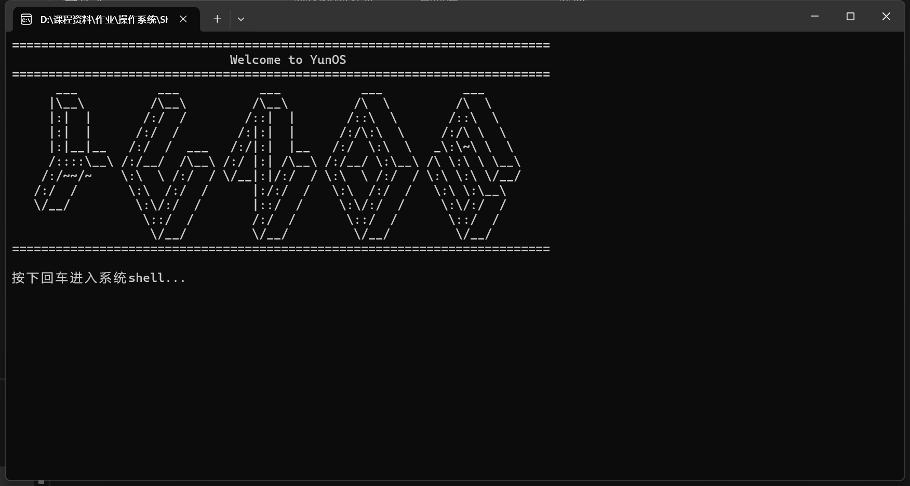

    2. 进入Shell

       按下回车进入Shell：

       ```bash
       守护进程已创建 (PID: 0)
       键入 'help' 以查看命令帮助
       YunOS>
       ```

       实验结果：

       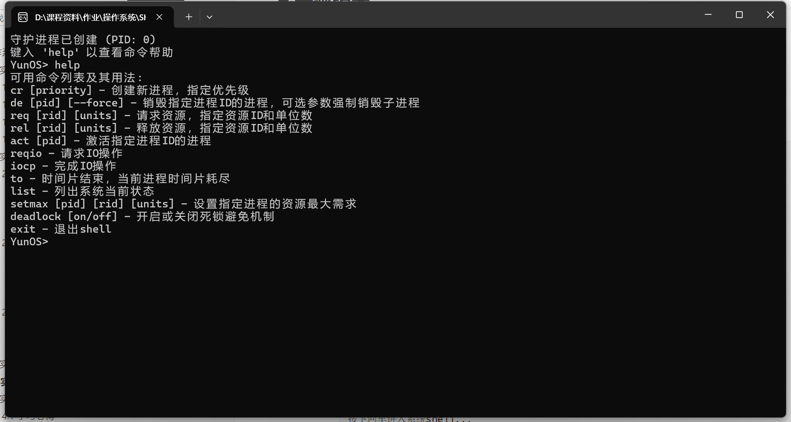

  - 查看用户帮助

    ```bash
    # 查看用户帮助
    YunOS> help
    
    预期输出：
    可用命令列表及其用法:
    cr [priority] - 创建新进程，指定优先级
    de [pid] [--force] - 销毁指定进程ID的进程，可选参数强制销毁子进程
    req [rid] [units] - 请求资源，指定资源ID和单位数
    rel [rid] [units] - 释放资源，指定资源ID和单位数
    act [pid] - 激活指定进程ID的进程
    reqio - 请求IO操作
    iocp - 完成IO操作
    to - 时间片结束，当前进程时间片耗尽
    list - 列出系统当前状态
    setmax [pid] [rid] [units] - 设置指定进程的资源最大需求
    deadlock [on/off] - 开启或关闭死锁避免机制
    exit - 退出shell
    ```

    

- 基本进程操作

  - 进程创建与销毁

    1. 基本进程创建

       ```bash
       # 创建不同优先级的进程
       YunOS> cr 0  # 创建高优先级进程
       YunOS> cr 1  # 创建中优先级进程
       YunOS> cr 2  # 创建低优先级进程
       YunOS> list  # 检查进程状态
       
       预期输出：
       # step 1
       进程 1 已创建，优先级 0
       进程 1 正在运行
       # step 2
       进程 2 已创建，优先级 1
       # step 3
       进程 3 已创建，优先级 2
       # step 4
       ================================= 进程状态 =================================
       PID     PRIO    STATE           MAX             ALLOC           NEED
       0       0       DEAMON           A:0 B:0 C:0    A:0 B:0 C:0     A:0 B:0 C:0
       1       0       RUNNING          A:0 B:0 C:0    A:0 B:0 C:0     A:0 B:0 C:0
       2       1       READY            A:0 B:0 C:0    A:0 B:0 C:0     A:0 B:0 C:0
       3       2       READY            A:0 B:0 C:0    A:0 B:0 C:0     A:0 B:0 C:0
       
       =========== 资源状态 ===========
       RID     TOTAL   AVAIL   WAITING
       A       3       3       none
       B       3       3       none
       C       2       2       none
       I       1       1       none
       
       ```

       实际输出：

       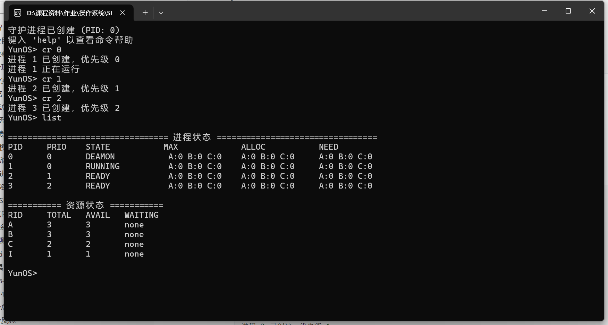

    2. 进程销毁

       ```bash
       # 测试普通销毁与强制销毁
       YunOS> cr 0  # 创建父进程
       YunOS> cr 1  # 创建子进程
       YunOS> de 1  # 普通销毁子进程
       YunOS> de 2 --force  # 强制销毁父进程
       
       预期输出：
       # step 1
       进程 1 已创建，优先级 0
       进程 1 正在运行
       # step 2
       进程 2 已创建，优先级 1
       # step 3
       将进程 1 的子进程转移至守护进程 0
       进程 2 已被转移至守护进程
       进程 1 已销毁，其子进程已转移至守护进程 0
       进程 2 正在运行
       # step 4
       进程 2 及其所有子进程已被强制销毁
       没有可运行的进程
       ```

       实际输出：

       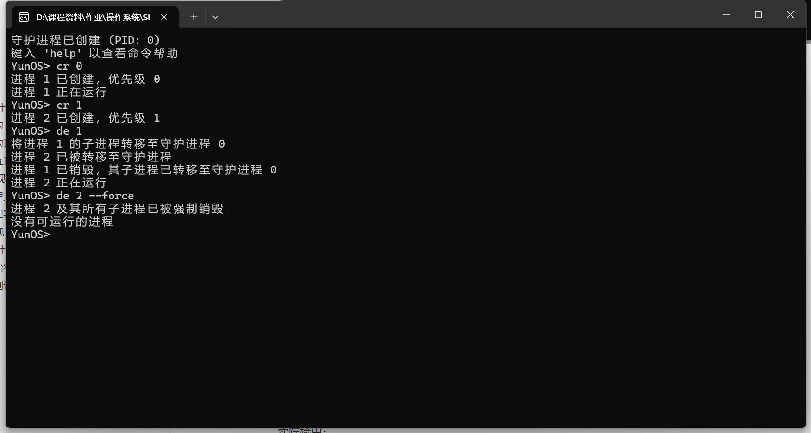

  - 进程间时间片轮转调度

    1. 同优先级进程轮转

       ```bash
       # 创建多个同优先级进程观察轮转
       YunOS> cr 1
       YunOS> cr 1
       YunOS> cr 1
       YunOS> to   # 触发时间片轮转
       YunOS> to
       YunOS> to
       YunOS> list
       
       预期输出：
       # step 1
       进程 1 已创建，优先级 1
       进程 1 正在运行
       # step 2
       进程 2 已创建，优先级 1
       # step 3
       进程 3 已创建，优先级 1
       # step 4 选取ready队尾进程
       进程 1 时间片耗尽，进入就绪队列
       进程 2 正在运行
       # step 5 选取ready队尾进程
       进程 2 时间片耗尽，进入就绪队列
       进程 3 正在运行
       # step 6 选取ready队尾进程
       进程 3 时间片耗尽，进入就绪队列
       进程 1 正在运行
       # step 7
       ================================= 进程状态 =================================
       PID     PRIO    STATE           MAX             ALLOC           NEED
       0       0       DEAMON           A:0 B:0 C:0    A:0 B:0 C:0     A:0 B:0 C:0
       1       1       RUNNING          A:0 B:0 C:0    A:0 B:0 C:0     A:0 B:0 C:0
       2       1       READY            A:0 B:0 C:0    A:0 B:0 C:0     A:0 B:0 C:0
       3       1       READY            A:0 B:0 C:0    A:0 B:0 C:0     A:0 B:0 C:0
       
       =========== 资源状态 ===========
       RID     TOTAL   AVAIL   WAITING
       A       3       3       none
       B       3       3       none
       C       2       2       none
       I       1       1       none
       ```

       实验结果：

       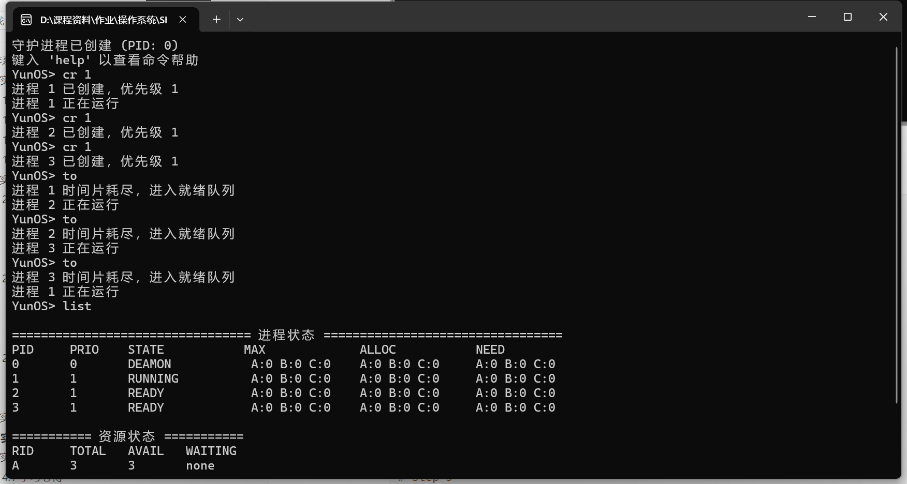

    2. 多优先级进程调度

       ```bash
       # 测试优先级抢占
       YunOS> cr 2  # 低优先级
       YunOS> cr 1  # 中优先级
       YunOS> cr 0  # 高优先级
       YunOS> to	# 触发时间片轮转
       YunOS> to	# 触发时间片轮转
       YunOS> list
       
       预期输出：
       # step 1
       进程 1 已创建，优先级 2
       进程 1 正在运行
       # step 2
       进程 2 已创建，优先级 1
       # step 3
       进程 3 已创建，优先级 0
       # step 4
       进程 1 时间片耗尽，进入就绪队列
       进程 3 正在运行
       # step 5 没有与3同级的其他进程 继续运行3
       进程 3 时间片耗尽，进入就绪队列
       进程 3 正在运行
       ================================= 进程状态 =================================
       PID     PRIO    STATE           MAX             ALLOC           NEED
       0       0       DEAMON           A:0 B:0 C:0    A:0 B:0 C:0     A:0 B:0 C:0
       1       2       READY            A:0 B:0 C:0    A:0 B:0 C:0     A:0 B:0 C:0
       2       1       READY            A:0 B:0 C:0    A:0 B:0 C:0     A:0 B:0 C:0
       3       0       RUNNING          A:0 B:0 C:0    A:0 B:0 C:0     A:0 B:0 C:0
       
       =========== 资源状态 ===========
       RID     TOTAL   AVAIL   WAITING
       A       3       3       none
       B       3       3       none
       C       2       2       none
       I       1       1       none
       ```

       实验结果：

       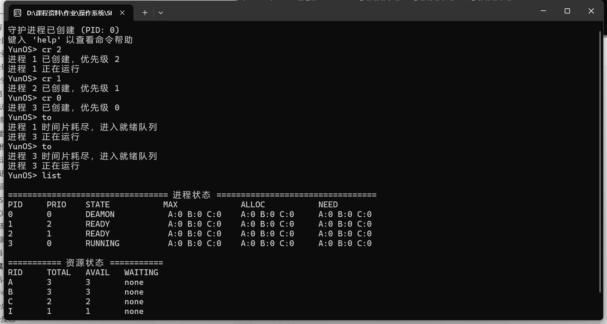

  - 资源分配与释放

    1. 普通资源请求与释放

       ```bash
       # 测试资源 A 的分配与释放
       YunOS> cr 0
       YunOS> req A 2  # 请求 2 个 A 资源
       YunOS> list     # 验证资源状态
       YunOS> rel A 1  # 释放 1 个 A 资源
       
       预期输出：
       # step 1
       进程 1 已创建，优先级 0
       进程 1 正在运行
       # step 2
       进程 1 获得资源 A，数量 2
       # step 3
       ================================= 进程状态 =================================
       PID     PRIO    STATE           MAX             ALLOC           NEED
       0       0       DEAMON           A:0 B:0 C:0    A:0 B:0 C:0     A:0 B:0 C:0
       1       0       RUNNING          A:0 B:0 C:0    A:2 B:0 C:0     A:-2 B:0 C:0
       
       =========== 资源状态 ===========
       RID     TOTAL   AVAIL   WAITING
       A       3       1       none
       B       3       3       none
       C       2       2       none
       I       1       1       none
       # step 4
       进程 1 释放资源 A，数量 2
       进程 1 正在运行
       ```

       实验结果：

       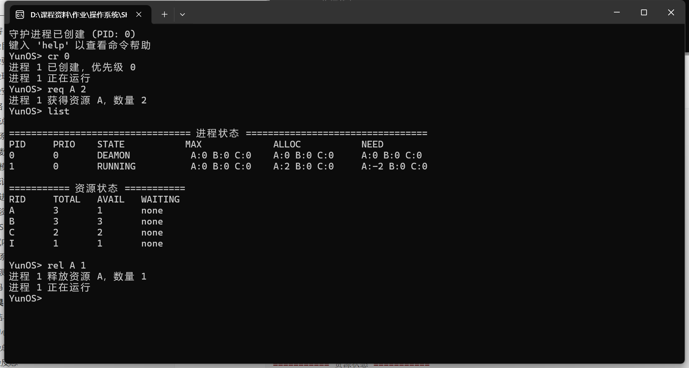

    2. 资源耗尽场景

       ```bash
       # 触发资源耗尽
       YunOS> cr 0
       YunOS> req A 3  # 请求所有 A 资源
       YunOS> cr 0
       YunOS> to 		# 切换到另一个进程
       YunOS> req A 1  # 请求已耗尽的资源
       
       预期输出：
       # step 1
       进程 1 已创建，优先级 0
       进程 1 正在运行
       # step 2
       进程 1 获得资源 A，数量 3
       # step 3
       进程 2 已创建，优先级 0
       # step 4
       进程 1 时间片耗尽，进入就绪队列
       进程 2 正在运行
       # step 5 为进程2申请已经耗尽的资源
       进程 2 阻塞，等待资源 A
       进程 1 正在运行
       ```

       实验结果：

       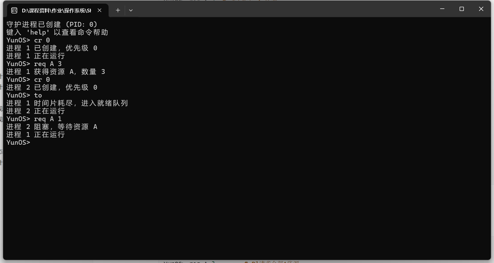

    3. 资源释放与重分配

       ```bash
       # 测试资源释放与重分配
       YunOS> cr 0           # P1
       YunOS> req A 3        # P1请求全部A资源
       YunOS> cr 0           # P2
       YunOS> to             # 切换到P2
       YunOS> req A 2        # P2请求A资源(阻塞)
       YunOS> cr 0           # P3
       YunOS> to             # 切换到P3
       YunOS> req A 1        # P3请求A资源(阻塞)，自动切换到P1运行
       YunOS> list           # 检查等待队列
       YunOS> rel A 3        # P1释放所有A资源
       YunOS> list           # 检查资源重分配情况
       
       预期输出：
       # step 1
       进程 1 已创建，优先级 0
       进程 1 正在运行
       # step 2
       进程 1 获得资源 A，数量 3
       # step 3
       进程 2 已创建，优先级 0
       # step 4
       进程 1 时间片耗尽，进入就绪队列
       进程 2 正在运行
       # step 5
       进程 2 阻塞，等待资源 A
       进程 1 正在运行
       # step 6
       进程 3 已创建，优先级 0
       # step 7
       进程 1 时间片耗尽，进入就绪队列
       进程 3 正在运行
       # step 8
       进程 3 阻塞，等待资源 A
       进程 1 正在运行
       # step 9
       ================================= 进程状态 =================================
       PID     PRIO    STATE           MAX             ALLOC           NEED
       0       0       DEAMON           A:0 B:0 C:0    A:0 B:0 C:0     A:0 B:0 C:0
       1       0       RUNNING          A:0 B:0 C:0    A:3 B:0 C:0     A:-3 B:0 C:0
       2       0       BLOCKED          A:0 B:0 C:0    A:0 B:0 C:0     A:0 B:0 C:0
       3       0       BLOCKED          A:0 B:0 C:0    A:0 B:0 C:0     A:0 B:0 C:0
       
       =========== 资源状态 ===========
       RID     TOTAL   AVAIL   WAITING
       A       3       0       2 3
       B       3       3       none
       C       2       2       none
       I       1       1       none
       # step 10
       进程 1 释放资源 A，数量 3
       进程 2 被唤醒，获得资源 A
       进程 3 被唤醒，获得资源 A
       进程 2 正在运行
       ```

       实验结果：

       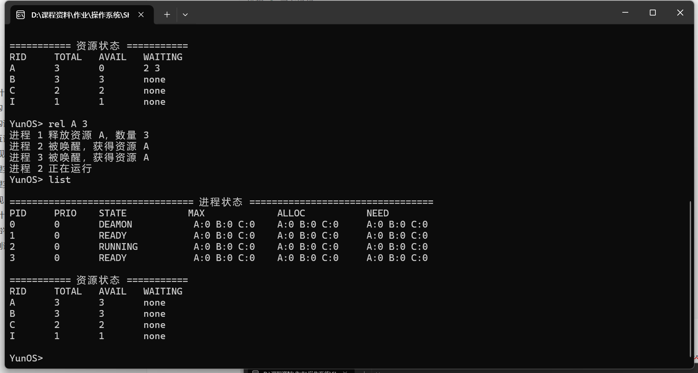

       

  - 线程销毁自动释放资源

    1. 持有资源进程销毁

       ```bash
       # 验证资源自动释放
       YunOS> cr 0
       YunOS> req A 2
       YunOS> de 1
       YunOS> list
       
       预期输出：
       # step 1
       进程 1 已创建，优先级 0
       进程 1 正在运行
       # step 2
       进程 1 获得资源 A，数量 2
       # step 3
       进程 1 释放资源 A，数量 2
       进程 1 正在运行
       进程 1 已销毁
       没有可运行的进程
       # step 4
       ================================= 进程状态 =================================
       PID     PRIO    STATE           MAX             ALLOC           NEED
       0       0       DEAMON           A:0 B:0 C:0    A:0 B:0 C:0     A:0 B:0 C:0
       
       =========== 资源状态 ===========
       RID     TOTAL   AVAIL   WAITING
       A       3       3       none
       B       3       3       none
       C       2       2       none
       I       1       1       none
       ```

       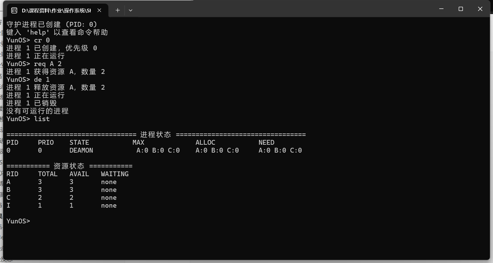

  - IO/普通资源竞争处理

    1. IO 请求与完成

       ```bash
       # IO 资源竞争测试
       YunOS> cr 0
       YunOS> cr 0
       YunOS> reqio  # 第一个进程请求 IO
       YunOS> reqio  # 第二个进程请求 IO
       YunOS> iocp   # IO 完成
       YunOS> iocp   # IO 完成
       
       预期输出：
       # step 1
       进程 1 已创建，优先级 0
       进程 1 正在运行
       # step 2
       进程 2 已创建，优先级 0
       # step 3
       进程 1 请求 IO，从运行态进入阻塞状态
       进程 2 正在运行
       # step 4
       进程 2 请求 IO，从运行态进入阻塞状态
       没有可运行的进程
       # step 5
       IO 完成，进程 1 从阻塞态转为就绪态
       进程 1 正在运行
       # step 6
       IO 完成，进程 2 从阻塞态转为就绪态
       进程 2 正在运行
       ```

       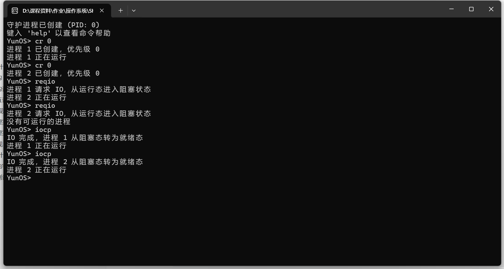

- 死锁情况测试

  - 死锁触发

    ```bash
    # 构造循环等待
    YunOS> deadlock off  # 关闭死锁避免
    YunOS> cr 0
    YunOS> cr 0
    YunOS> req A 3  # P1 获取资源 A
    YunOS> to
    YunOS> req B 3  # P2 获取资源 B
    YunOS> to
    YunOS> req B 1  # P1 请求资源 B
    YunOS> to
    YunOS> req A 1  # P2 请求资源 A
    
    预期输出：
    # step 1
    进程 1 已创建，优先级 0
    进程 1 正在运行
    # step 2
    进程 2 已创建，优先级 0
    # step 3
    进程 1 获得资源 A，数量 3
    # step 4
    进程 1 时间片耗尽，进入就绪队列
    进程 2 正在运行
    # step 5
    进程 2 获得资源 B，数量 3
    # step 6
    进程 2 时间片耗尽，进入就绪队列
    进程 1 正在运行
    # step 7
    进程 1 阻塞，等待资源 B
    进程 2 正在运行
    # step 8
    进程 2 阻塞，等待资源 A
    系统检测到可能的死锁。涉及的进程包括:
      - 进程 2 和进程 1
    建议的操作：
      - 考虑强制结束其中一个或多个进程来解除死锁。
      - 使用 'de [pid]' 命令可以结束特定进程。
    没有可运行的进程
    ```

    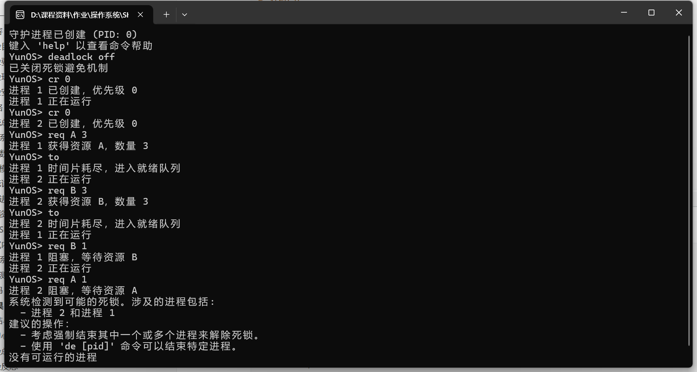

  - 死锁避免（银行家算法）

    ```bash
    # 启用死锁避免
    YunOS> deadlock on  # 开启死锁避免
    YunOS> cr 0
    YunOS> cr 0
    YunOS> req A 3  # P1 获取资源 A
    YunOS> to
    YunOS> req B 3  # P2 获取资源 B
    
    预期输出：
    # step 1
    已开启死锁避免机制
    # step 2
    为进程 1 配置最大资源需求:
    资源 A 的最大需求 (0 - 3): 3
    资源 B 的最大需求 (0 - 3): 1
    资源 C 的最大需求 (0 - 2): 0
    进程 1 已创建，优先级 0
    进程 1 正在运行
    # step 3
    用法：cr [priority]
    # step 4
    为进程 2 配置最大资源需求:
    资源 A 的最大需求 (0 - 3): 1
    资源 B 的最大需求 (0 - 3): 3
    资源 C 的最大需求 (0 - 2): 0
    进程 2 已创建，优先级 0
    # step 5
    进程 1 获得资源 A，数量 3
    # step 6
    进程 1 时间片耗尽，进入就绪队列
    进程 2 正在运行
    # step 7
    系统在分配后将进入不安全状态，进程 1 无法完成。
    ```

    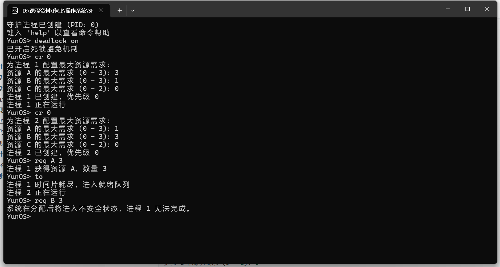

## 5.实验总结与反思

### 4.1 学习心得
- 知识点掌握情况

  ​	通过本次实验，我对操作系统的核心概念有了更深入的理解。在进程管理方面，通过实际编码实现了进程状态之间的转换机制，深刻理解了进程在就绪、运行、阻塞三种状态间切换的触发条件和具体过程。在调度算法的实现过程中，我不仅掌握了多级反馈队列的工作原理，还理解了如何将优先级调度与时间片轮转两种机制有机结合，从而实现更加灵活和高效的进程调度。

  对于死锁处理，本次实验让我对死锁的四个必要条件有了实践性的认识。通过实现银行家算法，我理解了死锁避免的具体策略和实现方法。特别是在处理资源分配时，我深入理解了如何通过系统状态的推演来判断分配操作的安全性，这大大加深了我对死锁避免机制的理解。

- 编程能力提升

  ​	本次实验显著提升了我的系统级编程能力。在处理进程控制和资源管理时，我学会了如何设计和维护复杂的数据结构，如进程控制块和资源控制块。这些数据结构的设计不仅需要考虑功能实现，还要兼顾系统运行效率和资源利用率。在模块化设计方面，我学会了如何将一个复杂的系统合理地分解为若干相对独立但又相互关联的模块。通过明确的接口定义和严格的模块化划分，不仅提高了代码的可维护性，也使得系统的扩展和修改变得更加容易。此外，在编程过程中，我特别注意了各种边界条件和异常情况的处理，这大大提高了程序的健壮性。

- 问题解决能力提升

  ​	本次实验培养了系统性的问题解决思维。面对复杂的系统设计，学会了先搭建框架、后充实细节的开发方法。这种自顶向下的思维方式，对于处理大型系统项目具有重要的指导意义。

### 4.2 实验总结
1. 技术总结
   - 算法实现心得
   
     ​	银行家算法的实现是本次实验的一大难点。通过预分配机制检查系统安全性，需要维护进程的最大需求向量和当前分配向量。在实现过程中，采用了状态保存和回滚机制，确保了算法的正确性。这种预见性的资源分配策略，有效避免了死锁的发生。

     ​	死锁检测算法采用了资源分配图的实现方式。通过构建和分析资源分配图，可以有效识别系统中的循环等待情况。算法在实现时特别注意了数据结构的选择，使用邻接表存储资源分配关系，提高了检测效率。
   
     ​	调度算法的实现融合了多种调度策略。在基本的优先级调度基础上，引入了时间片轮转机制，并设计了优先级衰减算法。这种复合式的调度策略，既保证了系统响应性，又避免了资源饥饿现象。
   
   - 代码优化经验
   
     ​	错误处理机制的设计尤为重要。实现了统一的错误码系统，对各类异常情况进行分类处理。同时，通过函数返回值和全局状态变量相结合的方式，确保了错误信息的准确传递。数据结构的选择也对系统性能有重要影响。在设计进程控制块和资源控制块时，充分考虑了访问效率和内存占用的平衡。采用数组和链表相结合的方式，既保证了快速索引，又支持动态扩展。调试技巧总结
   
2. 功能总结
   - 已实现功能
   
     ​	本次实验成功实现了操作系统的核心功能模块。在进程管理方面，完成了进程的完整生命周期管理，包括进程的创建、运行、阻塞和销毁等状态转换。实现了基于多级优先级的进程调度系统，能够根据进程的优先级和时间片进行合理的CPU分配。在资源管理方面，实现了统一的资源管理机制，支持多种类型资源的分配和回收。系统能够正确处理资源请求、进程阻塞和资源释放后的进程唤醒等过程。此外，还实现了死锁的检测与避免功能，通过银行家算法预防系统进入不安全状态。
   
   - 创新点分析
   
     ​	本系统在完成基本要求的基础上，实现了多个创新性的功能和设计。首先是进程管理的创新，设计了进程树结构，通过维护父子进程关系，实现了进程的层级化管理。特别是在进程销毁时，系统能够通过两种模式处理子进程：常规模式下将子进程转移给守护进程托管，强制模式下递归销毁整个进程树。这种灵活的进程关系处理机制显著提升了系统的实用性。
   
     ​	在资源管理方面，系统实现了可配置的死锁处理策略。通过`deadlock on/off`命令，用户可以动态切换是否启用死锁避免机制。当启用时，系统使用银行家算法进行预防；当关闭时，系统会实时检测死锁并提供详细的死锁信息，包括具体的进程和资源依赖关系，并给出解决建议。这种灵活的死锁处理机制使系统既能用于教学演示，又适合实际应用场景。
   
     ​	交互界面设计上，通过实现了一个功能完备的shell终端。不仅支持基本的进程和资源操作，还添加了`list`命令用于实时监控系统状态，展示进程状态、资源分配、等待队列等关键信息。同时，`setmax`命令允许动态调整进程的资源需求，为死锁避免策略的测试和演示提供了便利。系统的每个操作都会产生清晰的反馈信息，帮助用户理解系统的工作过程。这些创新性的设计不仅完善了系统的功能，也提高了系统的可用性和教学价值。通过这些扩展，用户可以更直观地理解和验证操作系统的核心概念，如进程管理、资源分配、死锁处理等。同时，这些功能的实现也为系统提供了更大的灵活性和实用性。
   
   - 性能优化和算法设计成果
   
     ​	通过多级队列的设计，显著减少了进程调度的开销。实现了高效的就绪队列管理机制，使得进程的调度和切换能够快速完成。在资源分配方面，采用了预分配策略，减少了进程阻塞和唤醒的频率，提高了系统的整体效率。

### 4.3 实验反思
1. 不足与改进
   - 代码质量方面
   
     ​	错误处理机制还不够统一，虽然实现了基本的错误检查，但缺乏系统化的错误恢复机制。未来可以设计更完善的异常处理框架，使系统能够更好地应对各种异常情况。此外，虽然代码中包含了必要的注释，但对于一些复杂的算法和数据结构的说明还可以更加详细。

3. 心得体会
   - 对操作系统的理解
   
     ​	通过本次实验，我深刻认识到操作系统是各种资源管理机制的综合体现。它不仅需要合理分配系统资源，还要在效率和公平性之间寻找平衡。在实现进程管理机制的过程中，我理解了为什么操作系统需要这样的抽象层次，以及如何通过这些抽象来简化应用程序的开发。实现调度算法和资源管理让我体会到了操作系统设计中的诸多权衡。例如，在进程调度时，需要平衡响应时间和吞吐量；在资源分配时，需要权衡系统利用率和公平性。这些都是操作系统设计中的核心问题。
   
   - 对系统编程的认识
   
     ​	系统级编程与应用层编程有很大的不同。在编写系统代码时，需要考虑更多的细节和边界情况，一个看似简单的功能背后可能涉及复杂的状态管理和错误处理。这让我深刻理解了为什么要强调代码的健壮性和可靠性。通过这次实验，我也认识到了模块化设计在大型系统中的重要性。良好的代码结构不仅有助于功能的实现，还能大大提高系统的可维护性和可扩展性。同时，充分的测试和调试在系统开发中也是不可或缺的环节，它们能够帮助我们及早发现和解决问题。
