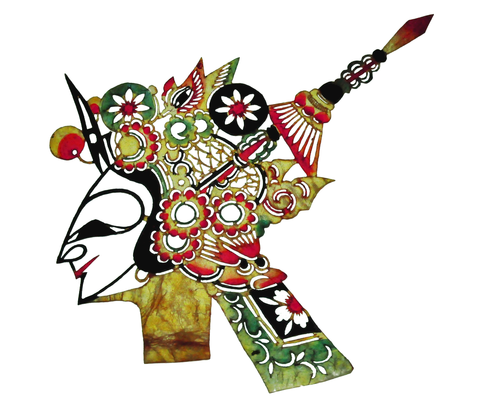

# 皮影戏 - 古画人物动画生成系统

<div align="center">
  
  
  一个基于深度学习的中国古画人物动画生成系统，将静态的古画人物转化为生动的动画。
</div>

## 🎭 项目简介

皮影戏是一个创新的AI应用，能够自动检测古画中的人物，将其从背景中分离，并生成具有传统艺术风格的动画视频。系统采用了多个先进的深度学习模型，包括目标检测、图像分割、背景修复等技术。

### 主要功能

- 📸 **智能人物检测**：使用 YOLOv5 自动检测古画中的人物
- ✂️ **精准背景分离**：使用 RMBG-2.0 模型分离人物与背景
- 🎨 **智能背景修复**：使用 LaMa 模型修复移除人物后的背景
- 🎬 **动画生成**：通过火山引擎 API 生成保持古画风格的人物动画
- 💾 **项目管理**：支持多项目管理，随时查看和下载生成的资产

## 🚀 快速开始

### 环境要求

- Python 3.8+
- Node.js 16+
- CUDA（可选，用于GPU加速）

### 1. 克隆项目

```bash
git clone https://github.com/yourusername/shadow-puppetry.git
cd shadow-puppetry
```

### 2. 后端配置

#### 2.1 创建虚拟环境

```bash
cd backend
python -m venv venv

# Windows
venv\Scripts\activate

# macOS/Linux
source venv/bin/activate
```

#### 2.2 安装依赖

```bash
pip install -r requirements.txt
```

<details>
<summary>requirements.txt 内容（如果不存在请创建）</summary>

```txt
flask==2.3.2
flask-cors==4.0.0
opencv-python==4.8.0.74
numpy==1.24.3
torch==2.0.1
torchvision==0.15.2
transformers==4.30.2
Pillow==9.5.0
werkzeug==2.3.6
requests==2.31.0
volcenginesdkarkruntime
iopaint
```

</details>

#### 2.3 下载必要的模型

1. **YOLOv5 模型**（会自动下载）
   - 首次运行时会自动从 ultralytics 下载

2. **RMBG-2.0 模型**
   ```bash
   # 模型会在首次运行时自动从 Hugging Face 下载
   # 也可以手动下载到 backend/models/RMBG-2.0/
   ```

3. **安装 IOPaint（用于 LaMa 背景修复）**
   ```bash
   pip install iopaint
   # LaMa 模型会在首次使用时自动下载
   ```

#### 2.4 配置火山引擎 API Key

在 `backend/util/video_generator.py` 中配置您的火山引擎 API Key：

```python
client = Ark(
    api_key="your-api-key-here"  # 替换为您的 API Key
)
```

> 注意：需要在[火山引擎](https://www.volcengine.com/)注册账号并获取 API Key

#### 2.5 启动后端服务

```bash
python app.py
```

后端服务将在 `http://localhost:5001` 启动

### 3. 前端配置

在新的终端窗口中：

```bash
cd front
npm install
npm run dev
```

前端服务将在 `http://localhost:5173` 启动

## 📖 使用指南

1. **上传图像**
   - 点击"新建项目"
   - 上传一张中国古画图像（支持 JPG、PNG 格式）

2. **检测人物**
   - 调整置信度阈值（默认 0.6）
   - 点击"检测人物"按钮
   - 系统会自动标记出检测到的人物

3. **获取图像资产**
   - 点击"获取图像资产"
   - 系统会分离出所有人物和修复后的背景
   - 可以预览和下载各个资产

4. **生成动画**
   - 选择要动画化的人物
   - 输入动作描述（如"侍女反复鞠躬"）
   - 设置动画时长
   - 点击"生成视频"

## 🛠️ 技术架构

### 前端技术栈
- React 18 + TypeScript
- Vite 构建工具
- Tailwind CSS + shadcn/ui
- Framer Motion 动画库

### 后端技术栈
- Flask Web 框架
- PyTorch 深度学习框架
- YOLOv5 目标检测
- RMBG-2.0 图像分割
- LaMa 图像修复
- 火山引擎 SDK

## 📁 项目结构

```
.
├── backend/                # 后端代码
│   ├── app.py             # Flask 主应用
│   ├── util/              # 工具模块
│   │   ├── yolo_detector.py      # YOLO 人物检测
│   │   ├── image_processor.py    # 图像处理
│   │   ├── video_generator.py    # 视频生成
│   │   └── model_manager.py      # 模型管理
│   ├── models/            # 模型文件目录
│   └── static/            # 静态文件目录
│       ├── uploads/       # 上传的原始图像
│       ├── processed/     # 处理后的图像
│       └── videos/        # 生成的视频
│
└── front/                 # 前端代码
    ├── src/
    │   ├── artifacts/     # 主应用组件
    │   └── components/    # UI 组件
    └── public/           # 公共资源
```

## ⚠️ 注意事项

1. **GPU 支持**：如果有 NVIDIA GPU，建议安装 CUDA 版本的 PyTorch 以获得更好的性能
2. **存储空间**：模型文件较大（约 2-3GB），请确保有足够的存储空间
3. **API 限制**：火山引擎 API 可能有调用频率限制，请查看相关文档
4. **图像要求**：建议上传清晰的传统中国画作品，人物形象越完整效果越好

## 🐛 常见问题

### Q: 模型下载失败怎么办？
A: 可以手动从 Hugging Face 下载 RMBG-2.0 模型，放置到 `backend/models/RMBG-2.0/` 目录

### Q: 视频生成失败？
A: 检查火山引擎 API Key 是否正确配置，账户是否有足够的额度

### Q: 人物检测不准确？
A: 尝试调整置信度阈值，或确保上传的图像中人物清晰可见
---

<div align="center">
  <i>让古画活起来，传承中华文化之美</i>
</div>