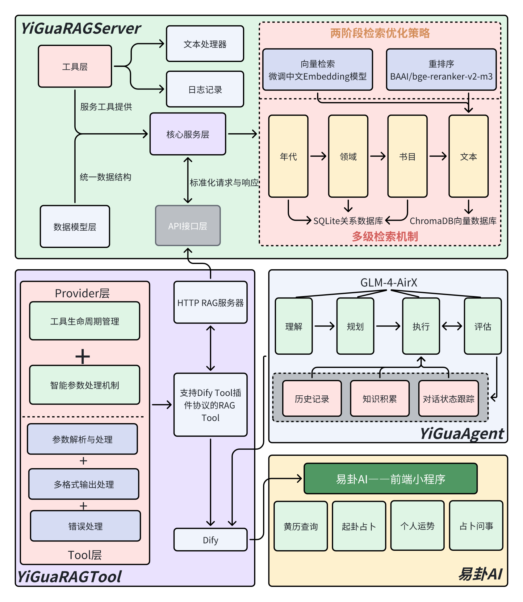

# 来易卦，来一卦——基于古汉语检索增强生成的易学咨询智能体

<div align="center">
  
  
  **2025年自然语言处理课程实践项目**
  
  [](https://www.python.org/)
  [](https://reactjs.org/)
  [](https://huggingface.co/BAAI/bge-large-zh-v1.5)
  [](https://github.com/SCUT-DLVCLab/C3bench)
</div>

## 📋 项目概览

本项目针对古汉语文本理解这一NLP领域的重要挑战，提出了一套完整的跨时语义检索解决方案。通过创新的双音节对齐替换技术和层次化知识组织方法，我们成功构建了一个产学研结合的易学咨询智能体系统。

### 🎯 核心成果

1. **技术创新**：提出基于双音节对齐替换的向量表示微调方法，在C³Bench基准测试上将Recall@1从89.17%提升至**93.44%**
2. **知识工程**：构建包含28部易学典籍、超过300万字符的层次化知识库
3. **系统实现**：开发完整的端到端易学咨询系统，包括模型微调、RAG服务、Dify插件和微信小程序
4. **实际应用**：系统已上线运营，两周内积累**8000+用户**，验证了技术方案的实用性

## 🏗️ 项目架构




## 📚 项目导航

### 1. [结题报告](./doc/自然语言处理课程实践结题报告.pdf)
完整的结题报告，详细介绍了项目的理论基础、方法创新和实验结果。**建议首先阅读**以了解项目的学术贡献。

- **摘要**：快速了解项目概况
- **第3节**：核心方法——双音节对齐替换技术
- **第4节**：实验结果与分析
- **附录B**：与mRASP方法的理论等价性证明

### 2. [YiGua_BGE_finetuning](./YiGua_BGE_finetuning/) - 模型微调
BGE模型的古汉语检索微调实现，是整个系统的技术核心。

**关键文件**：
- `tools/align_datas.py` - 双音节词对齐算法实现
- `train.py` - 模型训练主程序
- `evaluate.py` - C³Bench评估程序
- `outputs/figures/` - 实验结果可视化

**核心创新**：通过动态规划算法自动发现古文单字与现代双音节词的对应关系（如"月"→"月亮"），生成多粒度训练样本。

### 3. [YiGua_RAG_Server](./YiGua_RAG_Server/) - 检索服务
提供高性能的古籍检索服务，支持多级索引和两阶段检索。

**技术特点**：
- 年代→领域→书目→文本的四级索引结构
- 向量检索(BGE) + 重排序(Reranker)的两阶段策略
- 专门的文言文文本处理器

**API示例**：
```python
# 书目检索
POST /api/v1/books/search
{
    "dynasties": ["明", "清"],
    "domains": ["卜卦", "命理"]
}

# 文本检索
POST /api/v1/texts/search
{
    "title": ["周易", "增删卜易"],
    "queries": ["六爻", "变爻"]
}
```

### 4. [YiGua_RAG_Tool](./YiGua_RAG_Tool/) - Dify插件
将RAG服务无缝集成到Dify平台，支持Agent和工作流调用。

**功能模块**：
- `book_search` - 书目检索工具
- `text_search` - 文本检索工具
- 标准化的错误处理和多格式输出

### 5. [YiGua_Mini_APP](./YiGua_Mini_APP/) - 小程序前端
基于React的微信小程序，提供友好的用户交互界面。

**特色功能**：
- 3D铜钱投掷动画（Three.js + Cannon.js）
- 六爻卦象动态展示
- AI道长智能对话
- 黄历查询与运势分析

## 🚀 快速体验

### 方式一：在线体验
微信搜索小程序"**易卦AI**"即可体验完整功能。

### 方式二：本地部署

1. **部署RAG服务器**
```bash
cd YiGua_RAG_Server
pip install -r requirements.txt
python init_database.py
python app.py
```

2. **配置Dify插件**
```bash
cd YiGua_RAG_Tool
# 编辑.env文件配置Dify连接信息
python main.py
```

3. **启动前端开发服务器**
```bash
cd YiGua_Mini_APP
npm install
npm run dev
```

## 📊 实验数据

由于数据文件较大，请从百度网盘下载：
- 链接: https://pan.baidu.com/s/1r8PvMJhPct91faFCu0OIWA?pwd=p3f3
- 提取码: p3f3

包含内容：
- C³Bench评测数据集
- 古汉语-现代汉语平行语料
- 适应微调格式的数据

## 🙏 致谢

感谢自然语言处理课程的指导老师和助教，感谢北京智源人工智能研究院(BAAI)提供的BGE模型，感谢所有测试用户的宝贵反馈。

---

<div align="center">
  <i>让千年易学智慧，在AI时代绽放新的光彩</i>
</div>