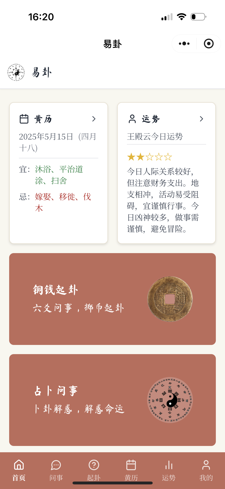
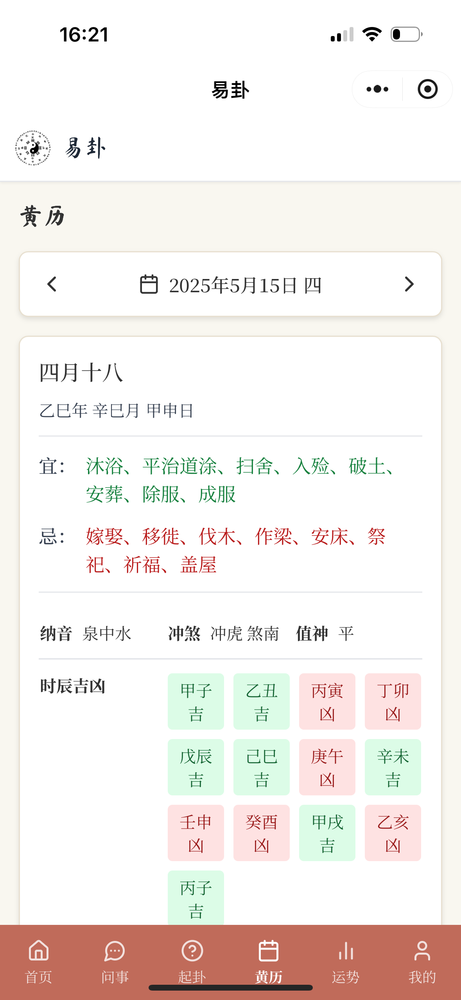
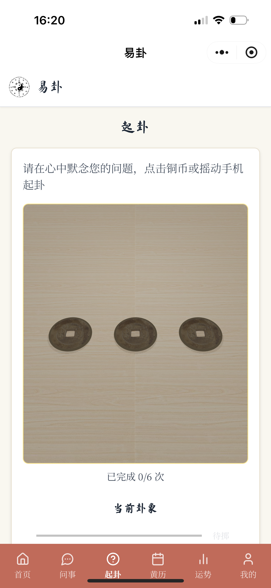
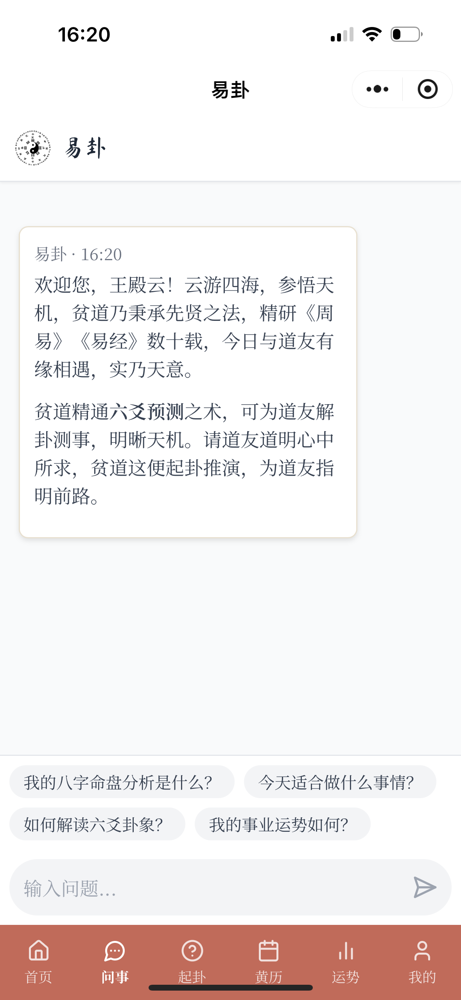

# 易卦AI小程序前端

<div align="center">
  
  
  **易卦AI - 传承千年智慧的易学咨询小程序**
  
  [](https://reactjs.org/)
  [](https://www.typescriptlang.org/)
  [](https://threejs.org/)
</div>

## 📖 项目简介

本项目是易卦AI系统的前端小程序部分，基于React + TypeScript开发，提供了易学咨询、黄历查询、六爻起卦、运势分析等功能的用户界面。通过集成后端的RAG检索服务和LLM对话能力，为用户提供专业的易学知识咨询服务。

## 🎨 界面预览

<div align="center">
  
  
  
  
</div>

## 🚀 功能模块

### 核心页面
- **首页** (`home.tsx`) - 展示今日黄历摘要和运势概况
- **黄历** (`CalendarPage.tsx`) - 详细的每日宜忌、神煞、时辰吉凶
- **起卦** (`DivinationPage.tsx`) - 3D铜钱投掷动画，六爻卦象生成
- **运势** (`FortuneAnalysisPage.tsx`) - 个人八字运势分析和趋势图表
- **问事** (`ChatPage.tsx`) - AI道长对话界面，支持多轮问答
- **个人中心** (`ProfilePage.tsx`) - 用户资料管理

### 特色组件
- **3D铜钱投掷** (`coin.tsx`) - 基于Three.js和Cannon.js的物理模拟
- **卦象展示** (`HexagramDisplay.tsx`) - 动态渲染六爻卦象
- **运势图表** - 基于Recharts的数据可视化

## 🛠️ 技术栈

- **框架**: React 18.3.1
- **语言**: TypeScript 5.5.0
- **构建工具**: Vite 5.4.17
- **样式**: TailwindCSS + 自定义CSS
- **3D渲染**: Three.js 0.142.0
- **物理引擎**: Cannon.js 0.6.2
- **图表**: Recharts 2.15.0
- **Markdown渲染**: react-markdown 10.1.0
- **命理计算**: tyme4ts 1.3.3

## 📦 快速开始

### 环境要求
- Node.js >= 16.0.0
- npm >= 7.0.0

### 安装运行

```bash
# 克隆项目
git clone [repository-url]
cd YiGua_Mini_APP

# 安装依赖
npm install

# 开发环境运行
npm run dev

# 构建生产版本
npm run build

# 预览构建结果
npm run preview
```

### 环境配置

在 `src/artifacts/ChatPage.tsx` 中配置API地址：

```typescript
const APP_KEY = 'your-api-key';
const API_URL = 'http://your-backend-url/v1';
```

## 📱 项目结构

```
src/
├── artifacts/          # 页面组件
│   ├── index.tsx      # 主入口和路由
│   ├── home.tsx       # 首页
│   ├── CalendarPage.tsx    # 黄历页
│   ├── DivinationPage.tsx  # 起卦页
│   ├── ChatPage.tsx        # AI问答页
│   └── ...
├── coin/              # 3D铜钱投掷模块
│   ├── renderer/      # Three.js渲染器
│   ├── physical-engine/    # 物理引擎
│   └── targets/       # 铜钱模型
├── components/        # UI组件库
│   └── ui/           # 基础组件
├── img/              # 图片资源
└── lib/              # 工具函数
```

## 🎯 核心特性

### 1. 传统文化UI设计
- 采用中国传统配色（#c06b5a）
- 使用"马杉正"书法字体
- 纸质感卡片设计

### 2. 3D交互体验
- 真实物理引擎模拟铜钱投掷
- 支持点击和设备摇动触发
- 流畅的动画效果

### 3. 智能对话集成
- 支持流式响应
- Agent思考过程可视化
- Markdown格式化输出

### 4. 本地数据存储
- 用户信息本地存储
- 占卜记录保存
- 隐私保护设计

## 🔧 开发指南

### 添加新页面

1. 在 `src/artifacts/` 创建新的页面组件
2. 在 `index.tsx` 中添加路由
3. 更新底部导航栏配置

### 自定义样式

全局样式定义在 `index.tsx` 的 `GlobalStyles` 组件中：

```css
.paper-card {
  background-color: #fff;
  border: 1px solid #e8e0d0;
  box-shadow: 0 2px 4px rgba(0, 0, 0, 0.1);
}

.primary-btn {
  background-color: #c06b5a;
  color: white;
}
```

## 📝 注意事项

1. **API依赖**: 本前端需要配合后端RAG服务使用
2. **浏览器兼容**: 3D功能需要支持WebGL的现代浏览器
3. **移动端优化**: 已针对移动设备进行触控和性能优化


<div align="center">
  <i>易卦AI小程序 - 让传统易学智慧触手可及</i>
</div>